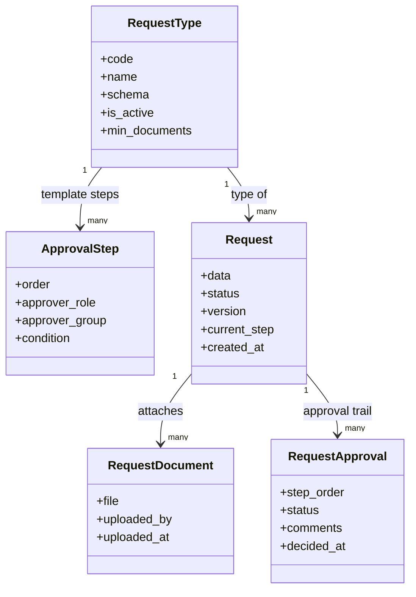
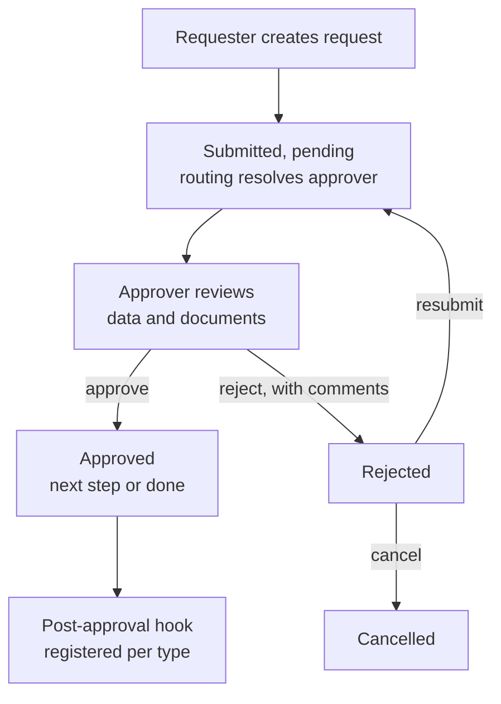
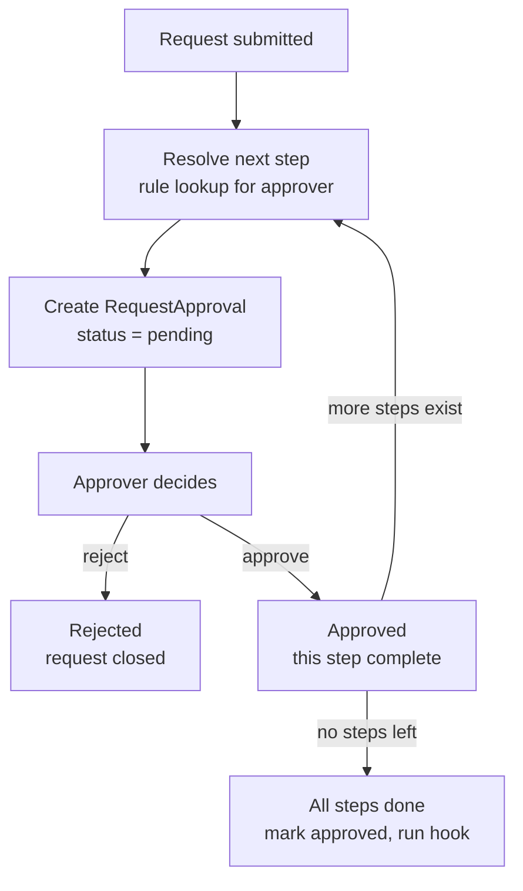
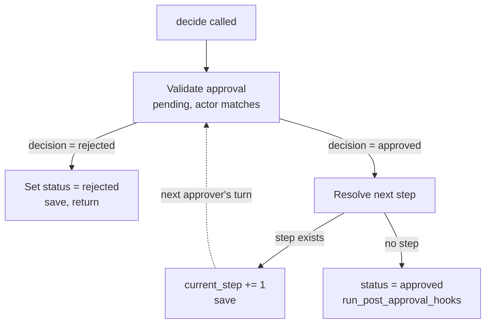
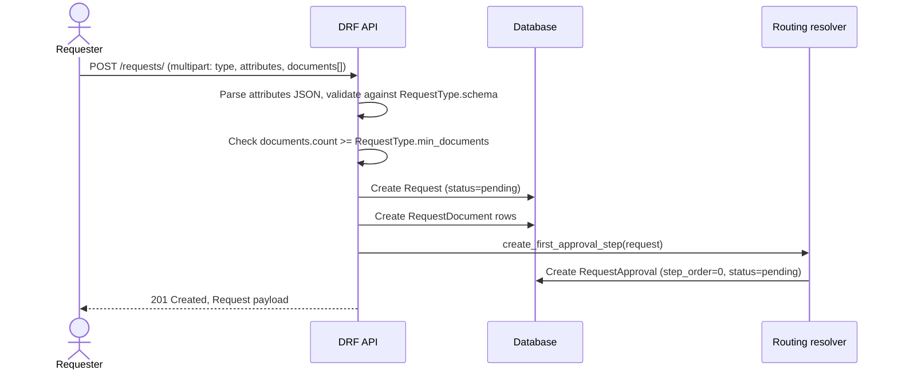
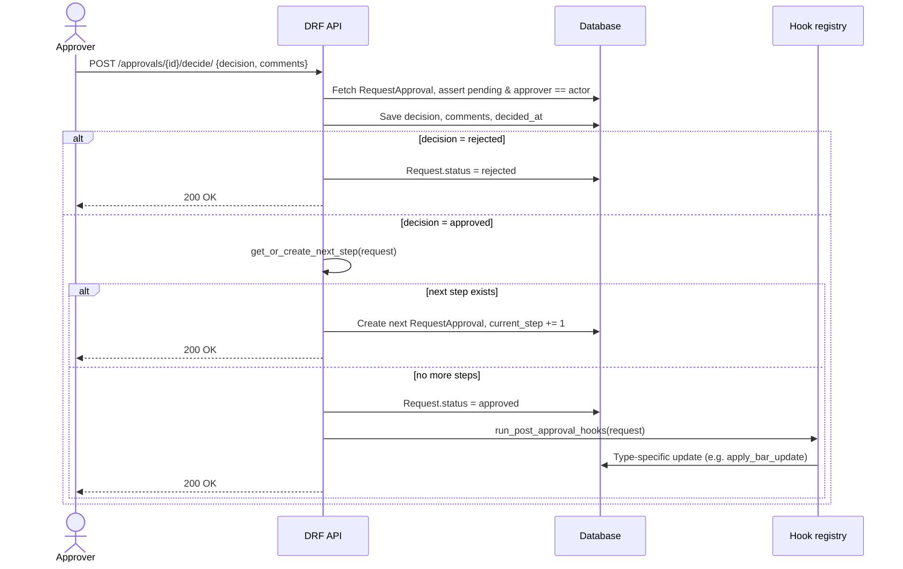
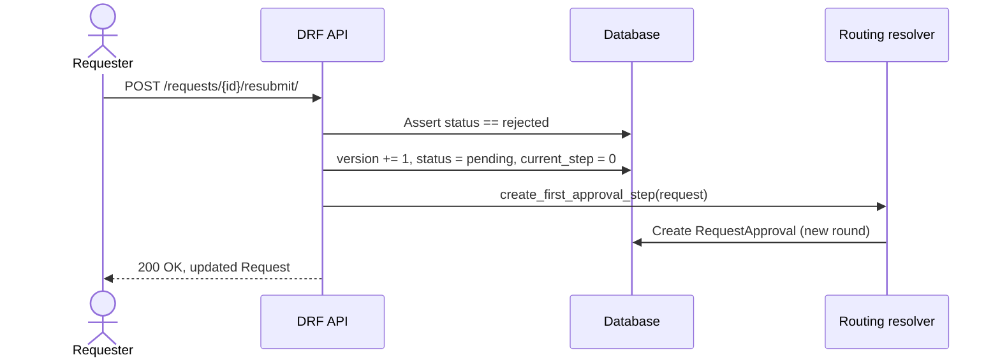
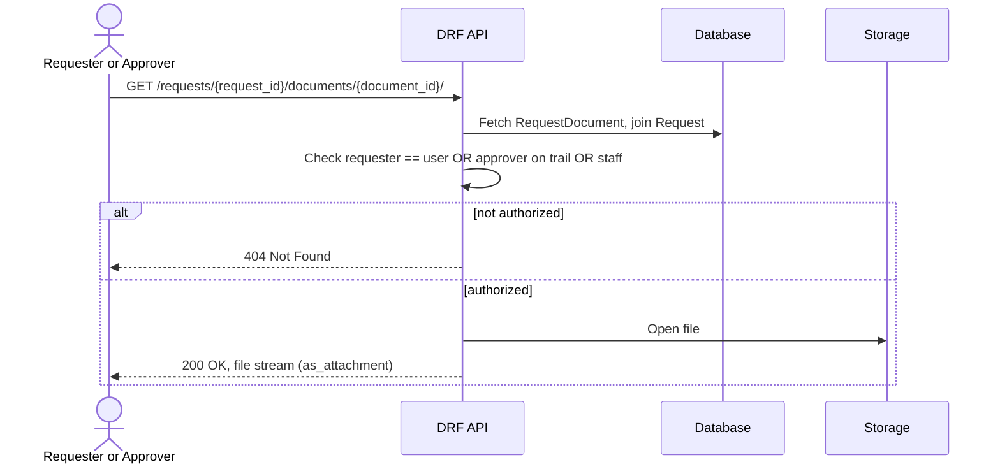

# 0010 — Generic Request & Approval Workflow

## Status

Proposed

## Context

Multiple parts of the system need a way for a user to raise a request with
supporting data and documents, have it routed to the right approver based on
rules, and trigger a follow-up action once approved. Rather than building a
bespoke request/approval flow per feature (leave requests, expense claims,
lawyer bar updates, etc.), this module provides one generic engine: a single
`Request` model with type-specific data in a JSON field, lazy per-step
approval routing, and a pluggable hook registered per request type.

The first request type built on this module is `LAWYER_BAR_UPDATE`.

## Goals

- One generic model + API surface that serves every request type, so adding
  a new type is configuration (a `RequestType` row, a schema, a hook) rather
  than new tables, serializers, or endpoints.
- Multi-step approval routing where the approver at each step can depend on
  the request's own data (amount, department, requester), not just a fixed
  chain of roles.
- A clear, auditable trail per request: who approved or rejected, when, and
  with what comments.
- Documents as first-class, access-controlled attachments on a request.
- Support for the full lifecycle a request can go through: draft, submit,
  approve/reject per step, resubmit after rejection, cancel.

## Non-goals

- Building a general-purpose BPM/workflow engine — no arbitrary DAGs,
  parallel branching approval steps, or a visual workflow designer; routing
  is linear, one pending approver at a time, resolved by rule per step.
- Validating document *content* — §8.1 checks document count against
  `min_documents`; verifying a document is the right kind, legible, or
  authentic is a manual reviewer task, not this module.
- Delegation / out-of-office routing in this iteration.
- A notification/reminder system for pending approvals.

## Proposed changes

### 1. Data model

Location: `apps.simple_requests.models`



`ApprovalStep` is the **template** — the rules used to resolve who approves
each step. `RequestApproval` is the **instance** — the actual per-request
record of who was asked, and what they decided. Keeping these separate is
what allows routing to depend on the specific request's data.

`RequestType.min_documents` is the minimum number of `RequestDocument`
attachments a submission must include, enforced at submit time (see §8.1).

`Request.status`: one of `draft`, `pending`, `approved`, `rejected`,
`cancelled`.

`RequestApproval.status`: one of `pending`, `approved`, `rejected`,
`skipped`.

### 2. Request lifecycle



### 3. Approval step resolution (lazy, per-step)



Routing rules (`ApprovalStep.approver_role` / `approver_group` /
`condition`) are evaluated against the request's `data`, `request_type`, and
`requester` at the moment each step is needed — not all at submission time.

### 4. `decide()` control flow

Location: `apps.simple_requests.services`



```python
def decide(approval: RequestApproval, decision: str, actor, comments=""):
    assert approval.status == "pending"
    assert approval.approver == actor

    approval.status = decision
    approval.comments = comments
    approval.decided_at = timezone.now()
    approval.save()

    request = approval.request
    if decision == "rejected":
        request.status = Request.Status.REJECTED
        request.save()
        return

    next_approval = get_or_create_next_step(request)
    if next_approval is None:
        request.status = Request.Status.APPROVED
        request.save()
        run_post_approval_hooks(request)
    else:
        request.current_step += 1
        request.save()
```

### 5. Post-approval hooks (registry pattern)

Location: `apps.simple_requests.hooks`

```python
POST_APPROVAL_HOOKS = {}


def register_hook(request_type_code):
    def decorator(fn):
        POST_APPROVAL_HOOKS[request_type_code] = fn
        return fn

    return decorator


def run_post_approval_hooks(request: Request):
    hook = POST_APPROVAL_HOOKS.get(request.request_type.code)
    if hook:
        hook(request)
```

Each request type registers independently — adding a new type never
requires editing the core approval engine.

### 6. First request type: `LAWYER_BAR_UPDATE`

**Schema** (validated against `Request.data`):

```json
{
  "type": "object",
  "required": ["name", "bar_number"],
  "properties": {
    "name": { "type": "string", "minLength": 1 },
    "bar_number": { "type": "string", "minLength": 1 }
  }
}
```

**Fields:** `name` (text), `bar_number` (text) — both in `data`.
**Documents:** one bar registration document, via `RequestDocument`
(`min_documents = 1` on the `RequestType` row).

**Hook:**

```python
@register_hook("LAWYER_BAR_UPDATE")
def apply_bar_update(request: Request):
    person = resolve_person_for_requester(request.requester)
    person.name = request.data["name"]
    person.bar_number = request.data["bar_number"]
    person.save(update_fields=["name", "bar_number"])
    doc = request.documents.first()
    LawyerBarDocument.objects.create(person=person, request_document=doc)
```

`LAWYER_BAR_UPDATE` requires no dedicated endpoint — it's created purely
through configuration (a `RequestType` row + schema + hook registration) and
submitted through the generic create endpoint below.

### 7. API — Submitter side

Location: `apps.simple_requests.views`, `apps.simple_requests.serializers`

| Method & path | Purpose |
|---|---|
| `POST /requests/` | Create a request. Generic across types — `request_type` + `attributes` (JSON string) + `documents[]`, multipart. |
| `GET /requests/` | List the caller's own requests. |
| `GET /requests/{id}/` | Retrieve one request. |
| `GET /requests/{id}/approvals/` | View the approval trail for a request. |
| `POST /requests/{id}/resubmit/` | Resubmit a rejected request (bumps `version`, restarts routing). |
| `POST /requests/{id}/cancel/` | Cancel a pending or rejected request. |
| `GET /request-types/` | List available types + schemas, for dynamic form rendering. |
| `GET /requests/{request_id}/documents/{document_id}/` | Download a specific attached document (explicit, authorization-checked). |

Request shape:

```
Content-Type: multipart/form-data

request_type: LAWYER_BAR_UPDATE
attributes:   {"name": "Jane Doe", "bar_number": "KAR/1234/2019"}
documents:    <file1>
documents:    <file2>
```

#### 7.1 Document count validation

`min_documents` is checked in the generic create serializer's `validate()`,
after `attributes` has been parsed and schema-checked but before `create()`
runs — so an under-documented submission never reaches the database:

```python
class GenericRequestCreateSerializer(serializers.Serializer):
    request_type = serializers.SlugRelatedField(
        slug_field="code", queryset=RequestType.objects.filter(is_active=True)
    )
    attributes = serializers.CharField()
    documents = serializers.ListField(
        child=serializers.FileField(),
        required=False,
        allow_empty=True,
    )

    def validate_attributes(self, value):
        try:
            parsed = json.loads(value)
        except (json.JSONDecodeError, TypeError):
            raise serializers.ValidationError("attributes must be a valid JSON object.")
        if not isinstance(parsed, dict):
            raise serializers.ValidationError("attributes must be a JSON object.")
        return parsed

    def validate(self, attrs):
        request_type = attrs["request_type"]
        validate_against_schema(request_type.schema, attrs["attributes"])

        doc_count = len(attrs.get("documents", []))
        if doc_count < request_type.min_documents:
            raise serializers.ValidationError(
                {
                    "documents": f"{request_type.name} requires at least "
                    f"{request_type.min_documents} document(s), got {doc_count}."
                }
            )
        return attrs
```

This checks count only, not document content or type — that a bar
certificate is actually a bar certificate, rather than any PDF, is either a
manual check (the approver looks at it during review) or a separate,
stricter mechanism (see Future TODO: `required_document_types`).

### 8. API — Approver side

| Method & path | Purpose |
|---|---|
| `GET /approvals/` | List pending approvals assigned to the caller. |
| `GET /approvals/?status=approved&status=rejected` | History of the caller's past decisions. |
| `GET /approvals/{id}/` | Retrieve one approval, with the nested request (data + documents). |
| `POST /approvals/{id}/decide/` | `{"decision": "approved"\|"rejected", "comments": "..."}` |
| `GET /requests/{request_id}/documents/{document_id}/` | Same document-download endpoint as submitter side — authorized to any approver on the trail. |

### 9. Sequence diagrams

#### 9.1 Submit a request



#### 9.2 Approver decides



#### 9.3 Resubmit after rejection



#### 9.4 Document download



## Affected files

- `src/apps/simple_requests/__init__.py`
- `src/apps/simple_requests/apps.py`
- `src/apps/simple_requests/models.py`
- `src/apps/simple_requests/serializers.py`
- `src/apps/simple_requests/views.py`
- `src/apps/simple_requests/urls.py`
- `src/apps/simple_requests/services.py`
- `src/apps/simple_requests/hooks.py`
- `src/apps/simple_requests/admin.py`
- `src/apps/simple_requests/tests/__init__.py`
- `src/apps/simple_requests/tests/test_models.py`
- `src/apps/simple_requests/tests/test_services.py`
- `src/apps/simple_requests/tests/test_views.py`
- `src/apps/simple_requests/tests/test_hooks.py`

## Open questions

1. Should `RequestType` support `required_document_types` (specific document
   categories, not just a count) for types that need more than "any N
   files"?
2. Should a requester's `GET /requests/{id}/` response expose *who* is
   currently sitting on the approval, or only aggregate status + comments?
3. If approvers can delegate (e.g. out-of-office), how should `GET
   /approvals/` and `decide()`'s actor check account for delegated-to-me
   items?
4. Document storage: stream through Django (simple, loads the app server) or
   issue short-lived signed URLs from S3/GCS (scales better, but splits
   authorization and byte-serving across two systems)?
5. Should every status transition (submit, each decision, resubmit, cancel,
   hook outcome) be logged in a dedicated `RequestAuditLog`, since
   `RequestApproval` rows alone don't capture cancellations or resubmission
   history?

## Out of scope

- Parallel or branching (DAG) approval routing — steps are strictly linear.
- Validating document *content* or authenticity — count only.
- Delegation / out-of-office approval routing.
- Notifications or reminders for pending approvals.
- Bulk request creation.

## Future TODO

- Add `required_document_types` to `RequestType` for types needing specific
  document categories, not just a minimum count.
- Support approver delegation.
- Add `RequestAuditLog` for a full transition history independent of
  `RequestApproval`.
- Decide and implement approver-identity visibility on the requester-facing
  API.
- Evaluate signed-URL document storage for scale.
- Notification/reminder system for pending approvals.