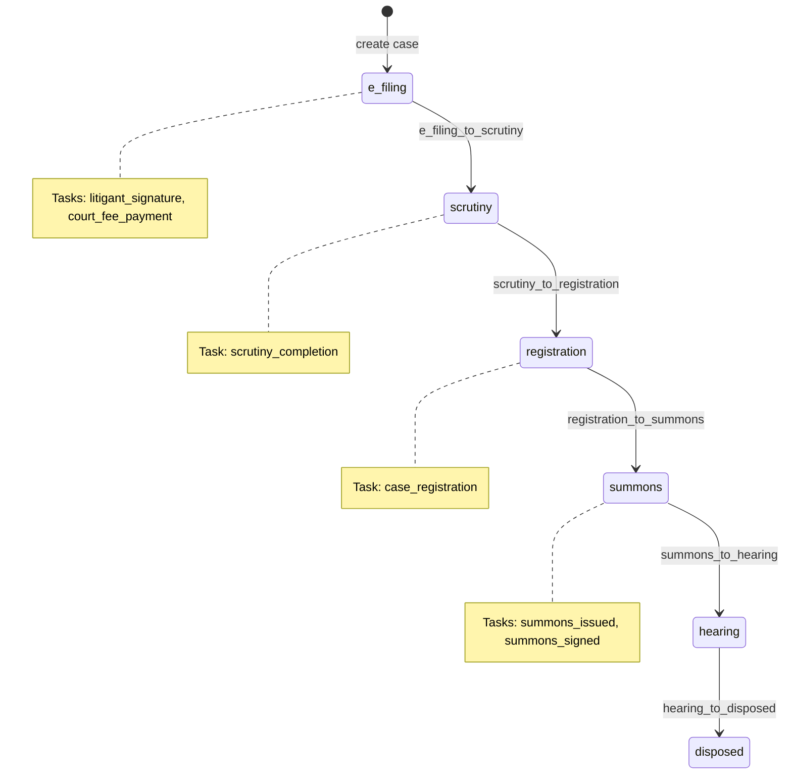
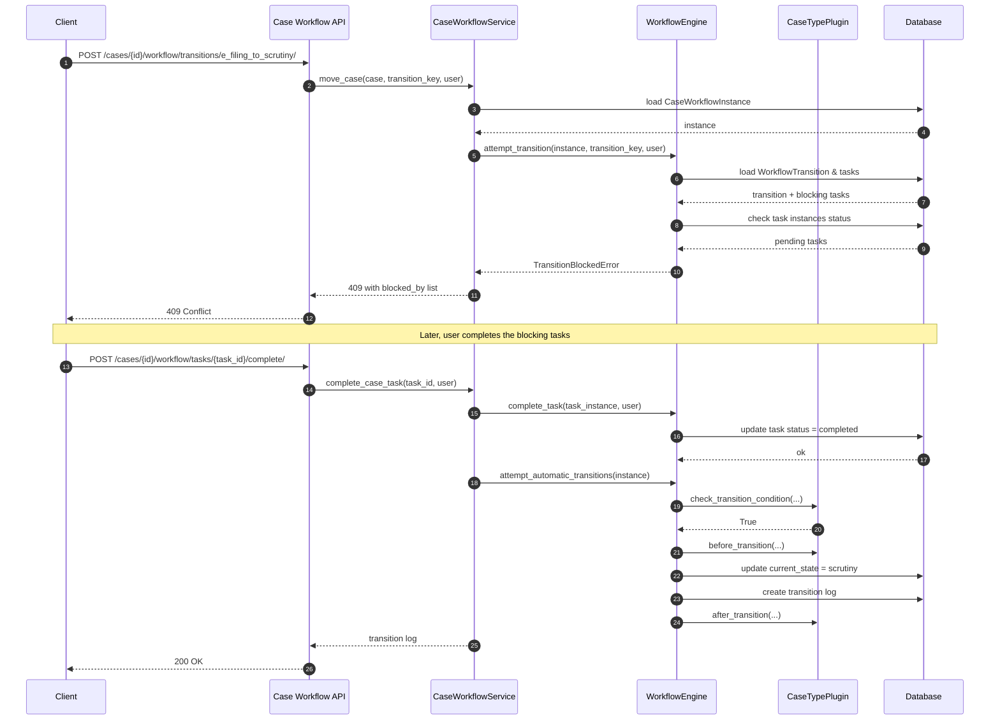
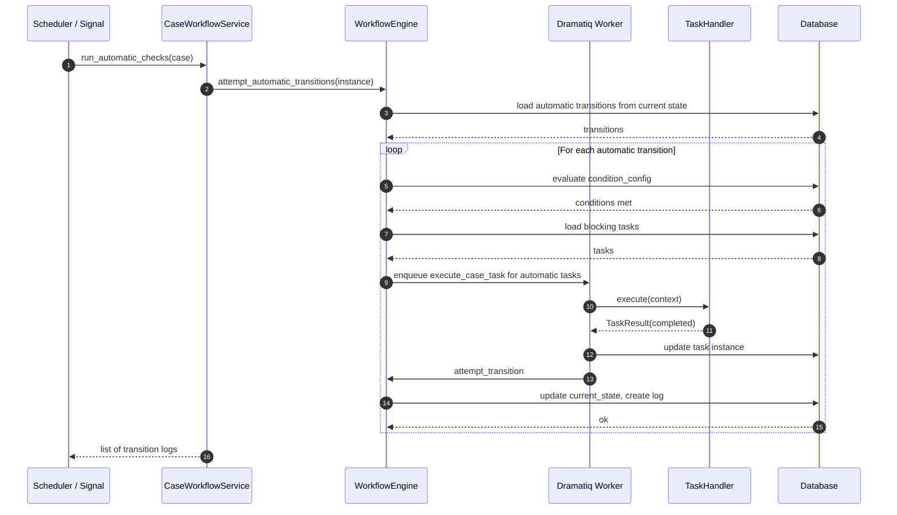

# 0011 — Case Workflows

## Status

Proposed

## Context

A `Case` in Dristi has a lifecycle: it is filed, scrutinised, registered, summoned, heard, and eventually disposed. Different `case_type`s (`checked_bounce_case`, `insurance_case`, etc.) may follow different lifecycles, and the same logical step can require different prerequisites (tasks, documents, signatures, payments, orders). Some transitions are performed by users; others are performed automatically when conditions are met.

We need a data-driven, extensible workflow engine that:

- Lets administrators define workflows, states, transitions, and required tasks per `case_type`.
- Creates a runtime instance for every case that records the current state, pending and completed tasks, and the history of movements.
- Allows both manual status moves and automatic transitions when prerequisites are satisfied.
- Lets each `case_type` provide custom validation, side-effects, and task handlers without forking the core engine.

## Goals

- Provide an abstract workflow engine under `apps.workflows`.
- Let a `case_type` be mapped to exactly one active `WorkflowDefinition` at a time.
- Model states, transitions, transition conditions, and required tasks as data.
- Track per-case runtime state in a `CaseWorkflowInstance` and per-task runtime state in a `CaseWorkflowTaskInstance`.
- Provide standard DRF APIs for workflow setup, task setup, task-transition association, case status movement, and case task movement.
- Allow each `case_type` to plug in a module (service class + task handlers) for custom behaviour while still using the shared engine.

## Non-goals

- A graphical workflow designer in this iteration.
- Replacing the existing `Case` model; this spec assumes a `Case` model with at least `id` and `case_type`.
- Full BPMN execution semantics (parallel gateways, inclusive gateways, timers, subprocesses).
- Reassignment/swim-lanes for human tasks in this iteration.

## Proposed changes

### 1. App layout

Create a reusable workflow app:

```
src/apps/workflows/
├── __init__.py
├── apps.py
├── models.py
├── admin.py
├── services.py
├── tasks.py
├── exceptions.py
├── views.py
├── serializers.py
├── urls.py
├── permissions.py
├── case_type_plugins/
│   ├── __init__.py
│   ├── base.py
│   ├── checked_bounce_case.py
│   └── insurance_case.py
├── transition_conditions/
│   ├── __init__.py
│   ├── base.py
│   └── registry.py
└── tests/
    ├── __init__.py
    ├── test_models.py
    ├── test_services.py
    ├── test_api.py
    └── test_plugins.py
```

Register `apps.workflows` in `src/config/settings/base.py` under `INSTALLED_APPS`.

This spec assumes the existence of a `apps.cases` app (or equivalent) that owns the `Case` model. If `apps.cases` does not yet exist, the implementation PR will create it or import it from the appropriate module.

### 2. Core models

All models inherit from `apps.core.models.BaseModel` unless noted.

#### 2.1 `WorkflowDefinition`

A named, versioned workflow that belongs to a single `case_type`.

| Field | Type | Notes |
|-------|------|-------|
| `name` | `CharField(max_length=255)` | Human-readable name, e.g. "Cheque Bounce Default Workflow". |
| `case_type` | `CharField(max_length=100, db_index=True)` | Matches `Case.case_type` values such as `checked_bounce_case`, `insurance_case`. |
| `version` | `PositiveIntegerField(default=1)` | Monotonic version. |
| `is_active` | `BooleanField(default=True)` | Only one active definition per `case_type` should normally be used for new cases. |
| `description` | `TextField(blank=True)` | Optional documentation. |
| `initial_state` | `CharField(max_length=100)` | State key where new cases start, e.g. `e_filing`. |

Constraints:

- Unique together: (`case_type`, `version`).
- At most one row per `case_type` may have `is_active=True`. Enforce via database partial unique index if supported, otherwise via application-level validation.

Validation:

- `initial_state` must match a `WorkflowState.state_key` that belongs to this workflow.

#### 2.2 `WorkflowState`

A state in a workflow.

| Field | Type | Notes |
|-------|------|-------|
| `workflow` | `FK → WorkflowDefinition` | |
| `state_key` | `CharField(max_length=100)` | Stable machine identifier, e.g. `e_filing`, `scrutiny`, `registration`, `summons`, `hearing`, `disposed`. |
| `label` | `CharField(max_length=255)` | Human-readable label. |
| `description` | `TextField(blank=True)` | |
| `is_terminal` | `BooleanField(default=False)` | `True` for final states such as `disposed` or `withdrawn`. |
| `sequence` | `PositiveSmallIntegerField(default=0)` | Display order; not enforced by the engine. |

Constraints:

- Unique together: (`workflow`, `state_key`).

Validation:

- `state_key` must be lowercase snake_case: `^[a-z][a-z0-9_]*$`.

#### 2.3 `WorkflowTransition`

A permissible move from one state to another.

| Field | Type | Notes |
|-------|------|-------|
| `workflow` | `FK → WorkflowDefinition` | |
| `from_state` | `CharField(max_length=100)` | Matches a `WorkflowState.state_key` in the same workflow. |
| `to_state` | `CharField(max_length=100)` | Matches a `WorkflowState.state_key` in the same workflow. |
| `transition_key` | `CharField(max_length=100)` | Stable identifier, e.g. `e_filing_to_scrutiny`. |
| `label` | `CharField(max_length=255)` | Human-readable label. |
| `is_automatic` | `BooleanField(default=False)` | If `True`, the engine evaluates this transition automatically when the case enters `from_state`. |
| `condition_config` | `JSONField(default=dict, blank=True)` | Data-driven conditions (see §4). |
| `requires_manual_confirmation` | `BooleanField(default=True)` | If `True`, a user with permission must explicitly trigger the transition even when automatic conditions are met. Ignored when `is_automatic=True`. |

Constraints:

- Unique together: (`workflow`, `from_state`, `to_state`).
- Unique together: (`workflow`, `transition_key`).

Validation:

- `from_state` and `to_state` must exist on the same workflow.
- `from_state != to_state`.
- `transition_key` must be lowercase snake_case.

#### 2.4 `TaskDefinition`

A reusable task template independent of any workflow.

| Field | Type | Notes |
|-------|------|-------|
| `task_key` | `CharField(max_length=100, unique=True)` | Stable identifier, e.g. `litigant_signature`, `court_fee_payment`, `case_registration`, `summons_issued`. |
| `name` | `CharField(max_length=255)` | Human-readable name. |
| `description` | `TextField(blank=True)` | |
| `task_type` | `CharField(max_length=50)` | One of `manual` (human), `automatic` (system), `approval` (human approval gate). |
| `handler_path` | `CharField(max_length=255, blank=True)` | Dotted path to a `TaskHandler` class for automatic tasks and custom validation. Optional for manual tasks. |
| `default_assignee_role` | `CharField(max_length=100, blank=True)` | Optional role hint such as `judge`, `clerk`, `litigant`. Not enforced in v1. |
| `config_schema` | `JSONField(default=dict, blank=True)` | JSON Schema describing configuration that a `WorkflowTaskTemplate` may supply. |

Validation:

- `task_key` must be lowercase snake_case.
- `task_type` must be one of the supported choices.
- If `task_type == "automatic"`, `handler_path` is required.

#### 2.5 `WorkflowTaskTemplate`

Links a `TaskDefinition` to a `WorkflowTransition`: the task must be completed (or skipped by an automatic handler) before the transition is allowed.

| Field | Type | Notes |
|-------|------|-------|
| `transition` | `FK → WorkflowTransition` | |
| `task` | `FK → TaskDefinition` | |
| `is_blocking` | `BooleanField(default=True)` | If `True`, the transition cannot proceed until this task is completed. |
| `is_required_on_entry` | `BooleanField(default=False)` | If `True`, the task instance is created as soon as the case enters `from_state`, not only when a transition is requested. |
| `execution_order` | `PositiveSmallIntegerField(default=0)` | Order in which automatic tasks are attempted. |
| `config` | `JSONField(default=dict, blank=True)` | Transition-specific configuration validated against `TaskDefinition.config_schema`. |

Constraints:

- Unique together: (`transition`, `task`).

Validation:

- `config` must validate against `task.config_schema`.
- A transition may not have the same task both blocking and non-blocking; the unique constraint on (`transition`, `task`) prevents duplicates.

#### 2.6 `CaseWorkflowInstance`

Runtime snapshot of a workflow for a specific case.

| Field | Type | Notes |
|-------|------|-------|
| `case` | `OneToOne → Case` | The case whose workflow is being tracked. |
| `workflow` | `FK → WorkflowDefinition` | Snapshot of the definition at the time the instance was created. |
| `current_state` | `CharField(max_length=100)` | Current `WorkflowState.state_key`. |
| `status` | `CharField(max_length=50)` | One of `active`, `paused`, `completed`, `cancelled`. |
| `started_at` | `DateTimeField(auto_now_add=True)` | |
| `completed_at` | `DateTimeField(null=True, blank=True)` | Set when entering a terminal state. |

Properties / behaviour:

- `is_terminal`: `True` if the current state is terminal.
- `is_active`: `True` if `status == "active"` and not terminal.
- On creation, `current_state` is copied from `workflow.initial_state`.

#### 2.7 `CaseWorkflowTaskInstance`

Runtime record of a task for a specific case and transition.

| Field | Type | Notes |
|-------|------|-------|
| `case_workflow` | `FK → CaseWorkflowInstance` | |
| `task_template` | `FK → WorkflowTaskTemplate` | |
| `task` | `FK → TaskDefinition` | Denormalised for querying. |
| `transition` | `FK → WorkflowTransition` | Denormalised for querying. |
| `status` | `CharField(max_length=50)` | One of `pending`, `in_progress`, `completed`, `skipped`, `failed`. |
| `started_at` | `DateTimeField(null=True, blank=True)` | |
| `completed_at` | `DateTimeField(null=True, blank=True)` | |
| `completed_by` | `FK → settings.AUTH_USER_MODEL, null=True, blank=True` | User who completed the task, if applicable. |
| `result_payload` | `JSONField(default=dict, blank=True)` | Output of an automatic task or metadata from a manual completion. |
| `error_message` | `TextField(blank=True)` | Last error message for failed automatic tasks. |
| `attempt_count` | `PositiveSmallIntegerField(default=0)` | Number of attempts for automatic tasks. |

Constraints:

- Unique together: (`case_workflow`, `task_template`, `transition`). A case may perform the same transition more than once only if the workflow definition intentionally allows re-entry; in that case distinct `task_template` rows or a new `CaseWorkflowInstance` are used.

#### 2.8 `CaseWorkflowTransitionLog`

Audit trail of every state change.

| Field | Type | Notes |
|-------|------|-------|
| `case_workflow` | `FK → CaseWorkflowInstance` | |
| `transition` | `FK → WorkflowTransition` | May be null for manual administrative overrides. |
| `from_state` | `CharField(max_length=100)` | |
| `to_state` | `CharField(max_length=100)` | |
| `triggered_by` | `FK → settings.AUTH_USER_MODEL, null=True, blank=True` | Null for automatic transitions. |
| `trigger_type` | `CharField(max_length=50)` | One of `manual`, `automatic`, `admin`. |
| `reason` | `TextField(blank=True)` | Optional comment. |
| `metadata` | `JSONField(default=dict, blank=True)` | Snapshot of conditions, task results, etc. |

### 3. Abstract services

Location: `apps.workflows.services`

#### 3.1 `WorkflowEngine`

The core state machine. It is case-type-agnostic.

```python
class WorkflowEngine:
    def create_instance(
        case: Case, workflow: WorkflowDefinition = None
    ) -> CaseWorkflowInstance: ...
    def evaluate_transition(
        case_workflow: CaseWorkflowInstance, transition: WorkflowTransition, context: dict = None
    ) -> TransitionEvaluationResult: ...
    def attempt_transition(
        case_workflow: CaseWorkflowInstance,
        transition_key: str,
        user=None,
        reason: str = "",
        context: dict = None,
    ) -> CaseWorkflowTransitionLog: ...
    def attempt_automatic_transitions(
        case_workflow: CaseWorkflowInstance, context: dict = None
    ) -> list[CaseWorkflowTransitionLog]: ...
    def complete_task(
        case_task: CaseWorkflowTaskInstance, user=None, result_payload: dict = None
    ) -> CaseWorkflowTaskInstance: ...
    def reset_task(
        case_task: CaseWorkflowTaskInstance, user=None, reason: str = ""
    ) -> CaseWorkflowTaskInstance: ...
```

Rules enforced by `WorkflowEngine`:

1. A transition is valid only if `from_state == case_workflow.current_state`.
2. A transition is allowed only if all blocking tasks on the transition are in `completed` or `skipped` status.
3. Automatic transitions are skipped if `case_workflow.status != "active"`.
4. Manual confirmation is required when `requires_manual_confirmation=True`, unless the caller has an explicit `can_force_transition` permission.
5. Terminal states set `case_workflow.status = "completed"` and `completed_at = now()`.
6. Entering a state creates `CaseWorkflowTaskInstance` rows for all tasks on outgoing transitions of that state where `is_required_on_entry=True`.
7. `CaseWorkflowTaskInstance` rows for automatic tasks are attempted immediately when created; failures are recorded but do not block other tasks unless they are blocking.

#### 3.2 `CaseWorkflowService`

Higher-level service that ties the engine to cases and case-type plugins.

```python
class CaseWorkflowService:
    def start_case_workflow(case: Case) -> CaseWorkflowInstance: ...
    def get_or_create_instance(case: Case) -> CaseWorkflowInstance: ...
    def get_available_transitions(case: Case) -> list[WorkflowTransition]: ...
    def move_case(
        case: Case, transition_key: str, user=None, reason: str = "", context: dict = None
    ) -> CaseWorkflowTransitionLog: ...
    def run_automatic_checks(case: Case) -> list[CaseWorkflowTransitionLog]: ...
    def complete_case_task(
        case_task_id: UUID, user=None, payload: dict = None
    ) -> CaseWorkflowTaskInstance: ...
    def fail_case_task(case_task_id: UUID, error_message: str) -> CaseWorkflowTaskInstance: ...
```

### 4. Transition conditions

Conditions are evaluated to decide whether an automatic transition may fire and to provide guardrails for manual transitions.

#### 4.1 Data-driven conditions (`condition_config`)

`WorkflowTransition.condition_config` is a JSON object that the engine interprets. Example structure:

```json
{
  "operator": "AND",
  "rules": [
    {"field": "case.filing_date", "operator": "is_not_null"},
    {"field": "case.is_paid", "operator": "equals", "value": true},
    {"field": "case_task.litigant_signature.status", "operator": "equals", "value": "completed"}
  ]
}
```

Supported operators in v1:

| Operator | Meaning |
|----------|---------|
| `equals` | Exact equality. |
| `not_equals` | Inequality. |
| `is_null` / `is_not_null` | Null checks. |
| `in` | Membership in a list. |
| `gt` / `gte` / `lt` / `lte` | Numeric comparisons. |

Logical combinators: `AND`, `OR`, `NOT`.

Fields may reference:

- `case.<field>` — fields on the `Case` model.
- `case_task.<task_key>.status` — status of a task instance on the current workflow.
- `workflow.current_state` — current state key.

#### 4.2 Custom conditions via case-type plugins

For logic that cannot be expressed declaratively, a case-type plugin may register a condition callable:

```python
class CheckedBounceCasePlugin(BaseCaseTypePlugin):
    case_type = "checked_bounce_case"

    def check_transition_condition(self, case, transition, context) -> bool:
        # custom business logic
        ...
```

The engine evaluates data-driven conditions first; if they pass and a plugin method exists, the plugin method is also evaluated. All must return `True`.

### 5. Task handlers

Location: `apps.workflows.case_type_plugins.base`

#### 5.1 `BaseTaskHandler`

```python
class BaseTaskHandler(ABC):
    def __init__(self, task_instance: CaseWorkflowTaskInstance):
        self.task_instance = task_instance

    @abstractmethod
    def execute(self, context: dict = None) -> TaskResult:
        """Run the task and return a result that updates the instance."""
        ...

    def can_execute(self, context: dict = None) -> bool:
        return True

    def on_failure(self, exception: Exception) -> None:
        self.task_instance.status = CaseWorkflowTaskInstance.Status.FAILED
        self.task_instance.error_message = str(exception)
        self.task_instance.save()
```

`TaskResult` is a small dataclass:

```python
@dataclass
class TaskResult:
    status: str  # completed, skipped, failed
    payload: dict = field(default_factory=dict)
    error_message: str = ""
```

Automatic tasks are executed inside `WorkflowEngine.complete_task` (or when created) by importing `TaskDefinition.handler_path`.

### 6. Case-type plugins

Location: `apps.workflows.case_type_plugins`

Each `case_type` gets a plugin module that can override default behaviour while remaining optional.

#### 6.1 `BaseCaseTypePlugin`

```python
class BaseCaseTypePlugin(ABC):
    case_type: ClassVar[str]

    def get_workflow_definition(self, case: Case) -> WorkflowDefinition:
        """Return the active workflow definition for this case type."""
        return WorkflowDefinition.objects.get(case_type=self.case_type, is_active=True)

    def on_enter_state(self, case: Case, state_key: str, previous_state: str | None) -> None:
        """Hook called after a state is entered."""
        pass

    def on_exit_state(self, case: Case, state_key: str, next_state: str) -> None:
        """Hook called before a state is exited."""
        pass

    def check_transition_condition(
        self, case: Case, transition: WorkflowTransition, context: dict = None
    ) -> bool:
        """Custom guard for a transition. Return False to block."""
        return True

    def before_transition(
        self, case: Case, transition: WorkflowTransition, context: dict = None
    ) -> None:
        """Side-effects before the transition is persisted."""
        pass

    def after_transition(
        self,
        case: Case,
        transition: WorkflowTransition,
        log: CaseWorkflowTransitionLog,
        context: dict = None,
    ) -> None:
        """Side-effects after the transition is persisted."""
        pass

    def get_task_handler(self, task_definition: TaskDefinition):
        """Return a handler class for an automatic task."""
        if task_definition.handler_path:
            return import_string(task_definition.handler_path)
        return None
```

#### 6.2 Plugin registry

Location: `apps.workflows.case_type_plugins`

```python
class CaseTypePluginRegistry:
    def register(self, plugin_class: type[BaseCaseTypePlugin]) -> None: ...
    def get(self, case_type: str) -> BaseCaseTypePlugin: ...


registry = CaseTypePluginRegistry()
```

Plugins are registered at application startup via `AppConfig.ready()`:

```python
class WorkflowsConfig(AppConfig):
    name = "apps.workflows"

    def ready(self):
        from .case_type_plugins import registry
        from .case_type_plugins.checked_bounce_case import CheckedBounceCasePlugin
        from .case_type_plugins.insurance_case import InsuranceCasePlugin

        registry.register(CheckedBounceCasePlugin)
        registry.register(InsuranceCasePlugin)
```

#### 6.3 Built-in plugins

For v1 provide two minimal plugins:

- `CheckedBounceCasePlugin` — sets `case_type = "checked_bounce_case"`; provides a handler for a sample automatic task such as `verify_cheque_bounce_notice`.
- `InsuranceCasePlugin` — sets `case_type = "insurance_case"`; provides a handler for a sample automatic task such as `verify_policy_expiry`.

Both plugins inherit from `BaseCaseTypePlugin` and only override what is necessary.

### 7. Async task execution

Location: `apps.workflows.tasks`

Automatic tasks that are slow or external should be executed asynchronously via Dramatiq.

```python
@actor
def execute_case_task(case_task_id: str, context: dict = None):
    """Run an automatic case workflow task and then re-evaluate automatic transitions."""
    ...
```

Flow:

1. Load the `CaseWorkflowTaskInstance` by id.
2. Resolve the handler from the task definition or case-type plugin.
3. Call `handler.execute(context)`.
4. Update the task instance status and payload.
5. Trigger `WorkflowEngine.attempt_automatic_transitions()` for the parent `CaseWorkflowInstance`.

### 8. Standard APIs

All APIs use Django REST Framework, return JSON, and follow the project's API conventions.

#### 8.1 Workflow setup management APIs

Base path: `/api/v1/workflows/`

| Method | Path | Purpose | Permission |
|--------|------|---------|------------|
| GET | `/workflows/` | List `WorkflowDefinition`s (filter by `case_type`, `is_active`). | `workflows.view_workflowdefinition` |
| POST | `/workflows/` | Create a new workflow definition. | `workflows.add_workflowdefinition` |
| GET | `/workflows/{id}/` | Retrieve a workflow definition with nested states and transitions. | `workflows.view_workflowdefinition` |
| PUT/PATCH | `/workflows/{id}/` | Update a workflow definition. | `workflows.change_workflowdefinition` |
| DELETE | `/workflows/{id}/` | Soft-delete or deactivate a workflow. | `workflows.delete_workflowdefinition` |
| POST | `/workflows/{id}/activate/` | Set this version as the active workflow for its `case_type`. | `workflows.change_workflowdefinition` |
| GET | `/workflows/{id}/states/` | List states in the workflow. | `workflows.view_workflowstate` |
| POST | `/workflows/{id}/states/` | Add a state to the workflow. | `workflows.add_workflowstate` |
| GET | `/workflows/{id}/transitions/` | List transitions in the workflow. | `workflows.view_workflowtransition` |
| POST | `/workflows/{id}/transitions/` | Add a transition to the workflow. | `workflows.add_workflowtransition` |

Response shape for `/workflows/{id}/`:

```json
{
  "id": "uuid",
  "name": "Cheque Bounce Default Workflow",
  "case_type": "checked_bounce_case",
  "version": 1,
  "is_active": true,
  "initial_state": "e_filing",
  "states": [...],
  "transitions": [...]
}
```

#### 8.2 Task setup management APIs

Base path: `/api/v1/workflow-tasks/`

| Method | Path | Purpose | Permission |
|--------|------|---------|------------|
| GET | `/workflow-tasks/` | List `TaskDefinition`s. | `workflows.view_taskdefinition` |
| POST | `/workflow-tasks/` | Create a task definition. | `workflows.add_taskdefinition` |
| GET | `/workflow-tasks/{id}/` | Retrieve a task definition. | `workflows.view_taskdefinition` |
| PUT/PATCH | `/workflow-tasks/{id}/` | Update a task definition. | `workflows.change_taskdefinition` |
| DELETE | `/workflow-tasks/{id}/` | Delete a task definition (blocked if in use). | `workflows.delete_taskdefinition` |

#### 8.3 Task association with movement APIs

Base path: `/api/v1/workflow-transitions/{transition_id}/tasks/`

| Method | Path | Purpose | Permission |
|--------|------|---------|------------|
| GET | `/workflow-transitions/{transition_id}/tasks/` | List `WorkflowTaskTemplate`s for a transition. | `workflows.view_workflowtasktemplate` |
| POST | `/workflow-transitions/{transition_id}/tasks/` | Attach a task to a transition. | `workflows.add_workflowtasktemplate` |
| GET | `/workflow-transitions/{transition_id}/tasks/{id}/` | Retrieve an association. | `workflows.view_workflowtasktemplate` |
| PUT/PATCH | `/workflow-transitions/{transition_id}/tasks/{id}/` | Update blocking/order/config flags. | `workflows.change_workflowtasktemplate` |
| DELETE | `/workflow-transitions/{transition_id}/tasks/{id}/` | Remove a task from a transition. | `workflows.delete_workflowtasktemplate` |

#### 8.4 Specific case workflow status movement APIs

Base path: `/api/v1/cases/{case_id}/workflow/`

| Method | Path | Purpose | Permission |
|--------|------|---------|------------|
| GET | `/cases/{case_id}/workflow/` | Retrieve the case's current workflow instance, state, and available transitions. | `workflows.view_caseworkflowinstance` |
| GET | `/cases/{case_id}/workflow/transitions/` | List transitions available from the current state. | `workflows.view_caseworkflowinstance` |
| POST | `/cases/{case_id}/workflow/transitions/{transition_key}/` | Trigger a manual transition. Body may include `reason` and `context`. | `workflows.change_caseworkflowinstance` |
| POST | `/cases/{case_id}/workflow/force/` | Admin-only move to an arbitrary state (with `to_state`, `reason`). | `workflows.force_caseworkflowinstance` |
| POST | `/cases/{case_id}/workflow/re-evaluate/` | Re-run automatic transition checks for this case. | `workflows.change_caseworkflowinstance` |

Response shape for `/cases/{case_id}/workflow/`:

```json
{
  "id": "uuid",
  "case": "uuid",
  "workflow": "uuid",
  "current_state": "e_filing",
  "status": "active",
  "is_terminal": false,
  "available_transitions": [
    {
      "transition_key": "e_filing_to_scrutiny",
      "label": "Submit for Scrutiny",
      "to_state": "scrutiny",
      "blocked_by": ["litigant_signature", "court_fee_payment"]
    }
  ],
  "pending_tasks": [...],
  "completed_tasks": [...],
  "history": [...]
}
```

#### 8.5 Case tasks workflow movement APIs

Base path: `/api/v1/cases/{case_id}/workflow/tasks/`

| Method | Path | Purpose | Permission |
|--------|------|---------|------------|
| GET | `/cases/{case_id}/workflow/tasks/` | List task instances for the case (filter by `status`, `transition`). | `workflows.view_caseworkflowtaskinstance` |
| GET | `/cases/{case_id}/workflow/tasks/{id}/` | Retrieve a task instance. | `workflows.view_caseworkflowtaskinstance` |
| POST | `/cases/{case_id}/workflow/tasks/{id}/complete/` | Mark a manual task as completed. Body may include `result_payload`. | `workflows.change_caseworkflowtaskinstance` |
| POST | `/cases/{case_id}/workflow/tasks/{id}/start/` | Move a task from `pending` to `in_progress`. | `workflows.change_caseworkflowtaskinstance` |
| POST | `/cases/{case_id}/workflow/tasks/{id}/reset/` | Reset a completed task back to `pending`. | `workflows.change_caseworkflowtaskinstance` |
| POST | `/cases/{case_id}/workflow/tasks/{id}/retry/` | Retry a failed automatic task. | `workflows.change_caseworkflowtaskinstance` |

For automatic tasks, `complete` returns `202 Accepted` and enqueues `execute_case_task` via Dramatiq; the task is updated asynchronously.

### 9. Permissions

Use Django model permissions mapped to DRF viewsets.

| Model | View | Add | Change | Delete | Custom |
|-------|------|-----|--------|--------|--------|
| `WorkflowDefinition` | `view_workflowdefinition` | `add_workflowdefinition` | `change_workflowdefinition` | `delete_workflowdefinition` | `activate_workflowdefinition` |
| `WorkflowState` | `view_workflowstate` | `add_workflowstate` | `change_workflowstate` | `delete_workflowstate` | |
| `WorkflowTransition` | `view_workflowtransition` | `add_workflowtransition` | `change_workflowtransition` | `delete_workflowtransition` | |
| `TaskDefinition` | `view_taskdefinition` | `add_taskdefinition` | `change_taskdefinition` | `delete_taskdefinition` | |
| `WorkflowTaskTemplate` | `view_workflowtasktemplate` | `add_workflowtasktemplate` | `change_workflowtasktemplate` | `delete_workflowtasktemplate` | |
| `CaseWorkflowInstance` | `view_caseworkflowinstance` | — | `change_caseworkflowinstance` | — | `force_caseworkflowinstance` |
| `CaseWorkflowTaskInstance` | `view_caseworkflowtaskinstance` | — | `change_caseworkflowtaskinstance` | — | |

In addition, the `CaseWorkflowService` checks object-level permissions on the parent `Case` for write operations (e.g. only users assigned to the case may trigger transitions). The exact object-level permission class is out of scope for this spec and will reuse the project's existing case permission backend.

### 10. Example: cheque-bounce workflow

A minimal workflow for `checked_bounce_case`:

```json
{
  "name": "Cheque Bounce Default Workflow",
  "case_type": "checked_bounce_case",
  "initial_state": "e_filing",
  "states": [
    {"state_key": "e_filing", "label": "E-Filing"},
    {"state_key": "scrutiny", "label": "Scrutiny"},
    {"state_key": "registration", "label": "Registration"},
    {"state_key": "summons", "label": "Summons"},
    {"state_key": "hearing", "label": "Hearing"},
    {"state_key": "disposed", "label": "Disposed", "is_terminal": true}
  ],
  "transitions": [
    {
      "transition_key": "e_filing_to_scrutiny",
      "from_state": "e_filing",
      "to_state": "scrutiny",
      "tasks": ["litigant_signature", "court_fee_payment"]
    },
    {
      "transition_key": "scrutiny_to_registration",
      "from_state": "scrutiny",
      "to_state": "registration",
      "tasks": ["scrutiny_completion"]
    },
    {
      "transition_key": "registration_to_summons",
      "from_state": "registration",
      "to_state": "summons",
      "tasks": ["case_registration"]
    },
    {
      "transition_key": "summons_to_hearing",
      "from_state": "summons",
      "to_state": "hearing",
      "tasks": ["summons_issued", "summons_signed"]
    },
    {
      "transition_key": "hearing_to_disposed",
      "from_state": "hearing",
      "to_state": "disposed",
      "is_automatic": false
    }
  ]
}
```

Task definitions used:

| Task key | Type | Purpose |
|----------|------|---------|
| `litigant_signature` | `manual` | Complainant signs the filing. |
| `court_fee_payment` | `manual` | Payment of court fees. |
| `scrutiny_completion` | `approval` | Court official approves scrutiny. |
| `case_registration` | `manual` | Registrar registers the case. |
| `summons_issued` | `automatic` | System generates summons. |
| `summons_signed` | `manual` | Judge signs the summons. |

The `summons_issued` task uses `apps.workflows.case_type_plugins.checked_bounce_case.handlers.SummonsIssuedHandler` to create a summons record and attach documents.

### 11. Lifecycle diagram



### 12. Sequence: manual transition with blocking tasks



### 13. Sequence: automatic transition



## Affected files

- `src/config/settings/base.py`
- `src/apps/workflows/__init__.py`
- `src/apps/workflows/apps.py`
- `src/apps/workflows/models.py`
- `src/apps/workflows/admin.py`
- `src/apps/workflows/services.py`
- `src/apps/workflows/tasks.py`
- `src/apps/workflows/exceptions.py`
- `src/apps/workflows/views.py`
- `src/apps/workflows/serializers.py`
- `src/apps/workflows/urls.py`
- `src/apps/workflows/permissions.py`
- `src/apps/workflows/case_type_plugins/__init__.py`
- `src/apps/workflows/case_type_plugins/base.py`
- `src/apps/workflows/case_type_plugins/checked_bounce_case.py`
- `src/apps/workflows/case_type_plugins/insurance_case.py`
- `src/apps/workflows/transition_conditions/__init__.py`
- `src/apps/workflows/transition_conditions/base.py`
- `src/apps/workflows/transition_conditions/registry.py`
- `src/apps/workflows/tests/test_models.py`
- `src/apps/workflows/tests/test_services.py`
- `src/apps/workflows/tests/test_api.py`
- `src/apps/workflows/tests/test_plugins.py`
- `src/config/urls.py` (mount `apps.workflows.urls`)

## Open questions

1. Should inactive workflow definitions be immutable once used by a `CaseWorkflowInstance`?
2. Should `WorkflowDefinition` support cloning to create a new version from an existing one?
3. Should task instances be created eagerly when entering a state, or lazily when a transition is first attempted?
4. Should failed automatic tasks retry automatically, and if so, should retry policy live on `TaskDefinition` or `WorkflowTaskTemplate`?
5. Should the engine support time-based conditions (e.g. "summons must be issued within 7 days")?
6. Should transition logs be append-only and never updated?
7. Should the `CaseWorkflowInstance` keep a snapshot of the workflow definition so that historical cases continue to use the rules that existed when they started?

## Out of scope

- Graphical workflow builder.
- Swim-lanes, role-based assignment, and reassignment of tasks.
- BPMN import/export.
- Timer events and scheduled escalations.
- Parallel execution of tasks within a transition.
- Audit history beyond `CaseWorkflowTransitionLog` and `CaseWorkflowTaskInstance` change tracking.
- Full object-level permission integration with case access rules (reuses existing project mechanism).

## Future TODO

- Add versioning UI and clone workflow endpoint.
- Implement swim-lanes and dynamic task assignment.
- Support timer-based conditions and scheduled re-evaluation.
- Add workflow simulation endpoint that tests a workflow against a synthetic case without persisting changes.
- Add `WorkflowDefinition` snapshotting so historical cases continue to follow the version they started with.