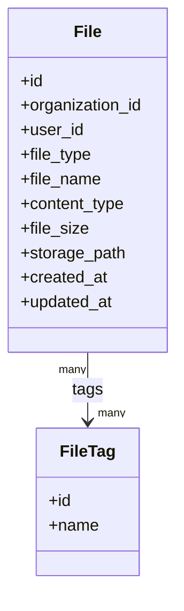
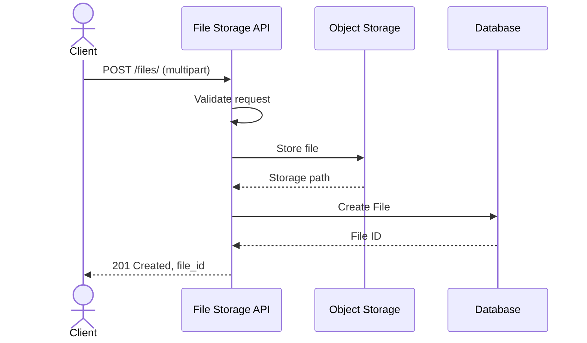
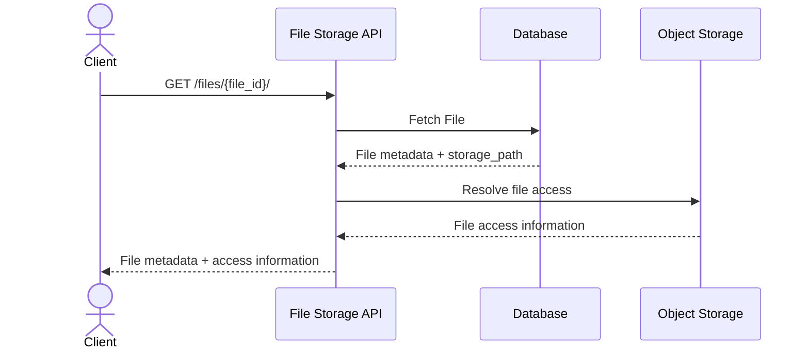

# 0012 — File Storage Service

## Status

Proposed

## Context

Multiple parts of the system need to upload and access files as part of their business flows. Rather than implementing file upload, storage, and retrieval separately in each module, this module provides a generic file storage service.

The service owns the file metadata and the physical file stored in Object Storage. Other services can reference a file using the `file_id` returned by this service.

The service should remain independent of the business context in which a file is used. For example, an application service may use a file as an address proof, while another service may use a file as an invoice.

## Goals

* Provide a generic API for uploading one or multiple files.
* Store file metadata in a `File` model.
* Store the actual file in Object Storage.
* Return a unique `file_id` that other services can use to reference the file.
* Support an optional `organization_id`.
* Track the user or system that uploaded the file through `user_id`.
* Support a controlled `file_type` ENUM.
* Support multiple arbitrary tags for filtering and search.
* Provide APIs to retrieve a single file.
* Provide APIs to search and list files.

## Non-goals

* Validating the business meaning or content of a file.
* OCR or extracting information from files.
* File conversion or preview generation.
* Virus/malware scanning in this iteration.
* Direct client-to-Object-Storage upload using signed URLs.
* Asynchronous file processing.
* File versioning.
* File sharing or permission management.
* Full-text search inside file contents.

---

## Proposed changes

### 1. Data model

Location: `apps.files.models`

Proposed model structure:



`File` stores the metadata required to identify and access a stored file.

`FileTag` stores reusable tags that can be associated with multiple files.

### 1.1 File fields

| Field             | Description                                     |
| ----------------- | ----------------------------------------------- |
| `id`              | Unique identifier of the file                   |
| `organization_id` | Organization associated with the file; nullable |
| `user_id`         | User or system that uploaded the file           |
| `file_type`       | Controlled type of the file                     |
| `file_name`       | Original file name                              |
| `content_type`    | MIME type                                       |
| `file_size`       | Size of the file                                |
| `storage_path`    | Object Storage path/key                         |
| `created_at`      | Time at which the file was created              |
| `updated_at`      | Time at which the file was last updated         |

`organization_id` is nullable because not every file needs to belong to an organization.

`user_id` identifies the actor that uploaded the file. This can represent either a user or a system/backend process.

### 1.2 File type

`file_type` should be an ENUM rather than an arbitrary string.

Initial values need to be finalized based on the requirements of the consuming modules.

For example:

```text
PHOTO
DOCUMENT
PDF
SIGNATURE
OTHER
```

These are examples only and are not intended to define the final enum.

### 1.3 Tags

A file can have multiple tags.

```text
File
 |
 +-- verification
 +-- identity
 +-- onboarding
```

Tags are intended for filtering/search and should not replace `file_type`.

Tag names should be normalized so that values such as:

```text
identity
Identity
IDENTITY
```

do not result in separate tags.

---

### 2. File upload

Location: `apps.files.views`, `apps.files.serializers`

```text
POST /files/
```

The API accepts `multipart/form-data` and supports multiple files in a single request.

Request:

```text
Content-Type: multipart/form-data

files: <file1>
files: <file2>
organization_id: <organization-id>
user_id: <user-id>
file_type: PDF
tags: verification
tags: application
```

`organization_id` is optional and can be null.

`user_id` identifies the user or system responsible for the upload.

Each uploaded file results in a separate `File` record and receives a separate `file_id`.

For example:

```text
POST /files/

files:
    application.pdf
    identity.pdf
```

results in:

```text
File
    application.pdf -> file_id = A

File
    identity.pdf   -> file_id = B
```

The response contains the generated IDs:

```json
{
  "files": [
    {
      "id": "A"
    },
    {
      "id": "B"
    }
  ]
}
```

The `file_id` is the only identifier that consuming services need to persist.

---

### 3. File storage

The actual file content is stored in Object Storage.

The database stores only the metadata and Object Storage path.



The `storage_path` should contain the Object Storage key/path and should not become part of the public API contract.

Example:

```text
files/<organization_id>/<year>/<month>/<file_id>/<file_name>
```

The exact path structure can be finalized during implementation.

The Object Storage implementation should be abstracted so that the File Storage service does not depend directly on a specific storage provider.

---

### 4. File ID

The `File.id` generated by this service is the reference used by other services.

For example:

```text
Application
    |
    +-- file_id = <file-id>
```

The Application service should not store or depend on:

```text
Object Storage bucket
Object Storage key
physical file path
storage provider
```

This keeps the storage implementation internal to the File Storage module.

---

### 5. Get file

Location: `apps.files.views`, `apps.files.serializers`

```text
GET /files/{file_id}/
```

The API retrieves a single file using its `file_id`.

Example response:

```json
{
  "id": "file-123",
  "organization_id": "org-123",
  "user_id": "user-123",
  "file_type": "PDF",
  "file_name": "address-proof.pdf",
  "content_type": "application/pdf",
  "file_size": 245678,
  "tags": [
    "verification",
    "address-proof"
  ],
  "created_at": "2026-09-16T10:30:00Z"
}
```

The API should also provide a mechanism for the caller to access the actual file.

The exact approach is kept as an open design decision:

* Stream the file through the API.
* Return a short-lived signed URL.
* Provide a separate download endpoint.

---

### 6. Search/list files

```text
GET /files/
```

The API should support listing and searching files using file metadata.

Initial filters:

```text
organization_id
user_id
file_type
tags
```

Examples:

```text
GET /files/?organization_id=<organization-id>
```

```text
GET /files/?user_id=<user-id>
```

```text
GET /files/?file_type=PDF
```

```text
GET /files/?tags=verification
```

Multiple filters can be combined:

```text
GET /files/
    ?organization_id=<organization-id>
    &file_type=PDF
    &tags=verification
```

The response should be paginated.

Example:

```json
{
  "results": [
    {
      "id": "file-123",
      "file_name": "address-proof.pdf",
      "file_type": "PDF"
    }
  ],
  "count": 1
}
```

---

### 7. File access

The File Storage service should not expose the Object Storage path directly to consumers.

The expected flow is:



The exact implementation of file access is intentionally left open for this iteration.

---

## 8. API

Location: `apps.files.views`, `apps.files.serializers`, `apps.files.urls`

| Method & path           | Purpose                       |
| ----------------------- | ----------------------------- |
| `POST /files/`          | Upload one or multiple files. |
| `GET /files/`           | Search/list files.            |
| `GET /files/{file_id}/` | Retrieve a single file.       |

---

## 9. Upload failure handling

A file should not have a database record if its Object Storage upload has failed.

Expected flow:

```text
Validate request
      |
      v
Upload to Object Storage
      |
      v
Create File record
      |
      v
Create tag associations
      |
      v
Return file_id
```

If Object Storage upload fails, the API should return an appropriate error and should not create a `File` record.

If Object Storage succeeds but database creation fails, the implementation should attempt to clean up the uploaded object to avoid orphaned files.

The exact transaction and cleanup mechanism can be finalized during implementation.

---

## 10. Pagination

`GET /files/` should support pagination.

Initial implementation can use page-based pagination:

```text
GET /files/?page=1&page_size=20
```

The pagination approach can be changed to cursor-based pagination later if the expected number of files requires it.

---

## 11. Affected files

Initial implementation is expected to add:

```text
apps/files/__init__.py
apps/files/apps.py
apps/files/models.py
apps/files/serializers.py
apps/files/views.py
apps/files/urls.py
apps/files/services.py
apps/files/storage.py
apps/files/admin.py
apps/files/tests/test_models.py
apps/files/tests/test_services.py
apps/files/tests/test_views.py
```

---

## 12. Open questions

1. Should `GET /files/{file_id}/` return a short-lived signed URL, stream the file through Django, or should there be a separate download API?

2. What should be the initial `FileType` ENUM values?

3. How should a system/backend owner be represented in `user_id`?

4. Should tags be global across the system or scoped to an `organization_id`?

5. When searching with multiple tags, should the result match files having **all** tags or **any** of the tags?

6. Should the initial list API use page-based pagination or cursor-based pagination?

7. Which Object Storage provider should be supported initially?

8. Should the Object Storage interface support multiple providers from the beginning, or should we start with the provider used by Dristi?

9. What should be the maximum file size and maximum number of files allowed in a single upload request?

10. Should the upload API validate file extensions/content types, or should this be handled by a separate validation mechanism?

---

## 13. Out of scope

* Direct client-to-Object-Storage upload using signed URLs.
* Asynchronous upload/processing.
* File content validation or authenticity verification.
* OCR.
* File conversion.
* Thumbnail generation.
* File versioning.
* File sharing.
* File deletion.
* Access-control/permission management.
* Full-text search inside file contents.
* Notifications related to file upload.

---

## 14. Future TODO

* Evaluate signed URL based upload for large files.
* Add file deletion API and Object Storage cleanup.
* Add file access/permission model if required.
* Add virus/malware scanning.
* Add file versioning if required.
* Add content-based search if required.
* Add support for additional Object Storage providers.
