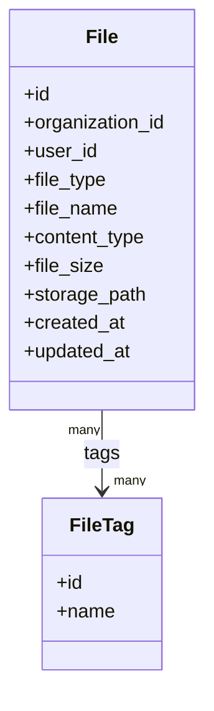
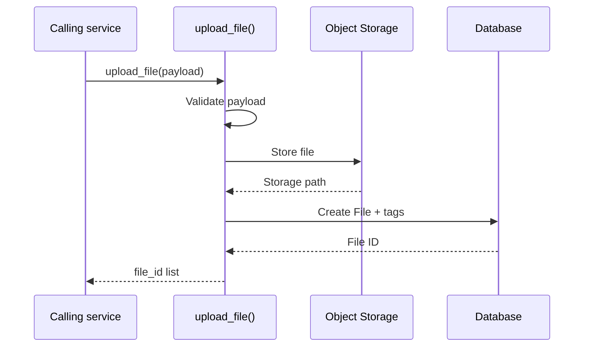

# 0014 — File Storage Service

## Status

Proposed

## References

- [0000 — API Coding Spec](0000-api-coding-spec.md) — model/style constraints
- [0016 — PDF Service](0016-pdf-services.md) — consumer: stores generated documents
- [0015 — eSign Module and CDAC eSign Addon](0015-cdac-esign.md) — consumer: stores prepared and signed PDFs, reads content in-process, cleans up placeholders

## Context

Multiple parts of the system need to upload and access files as part of their business flows. Rather than implementing file upload, storage, and retrieval separately in each module, this module provides a generic file storage service.

The service owns the file metadata and the physical file stored in Object Storage. Other services can reference a file using the `file_id` returned by this service.

The service should remain independent of the business context in which a file is used. For example, an application service may use a file as an address proof, while another service may use a file as an invoice.

**This iteration does not expose any REST API.** The module is consumed **in-process** by other Django apps through service-level functions only. REST endpoints, if needed later, will be added as a thin layer on top of these functions.

## Goals

* Provide service-level functions for uploading one or multiple files.
* Store file metadata in a `File` model.
* Store the actual file in Object Storage.
* Return a unique `file_id` that other services can use to reference the file.
* Support an optional `organization_id`.
* Track the user or system that uploaded the file through `user_id`.
* Support a controlled `file_type` ENUM.
* Support multiple arbitrary tags for filtering and search.
* Provide a function to retrieve a single file's metadata.
* Provide a function to read a stored file's content in-process.
* Provide a function to delete a file and its stored object.
* Provide a function to search/list files.

## Non-goals

* REST/HTTP APIs, DRF serializers, viewsets, or URL routing in this iteration.
* Validating the business meaning or content of a file.
* OCR or extracting information from files.
* File conversion or preview generation.
* Virus/malware scanning in this iteration.
* Direct client-to-Object-Storage upload using signed URLs.
* Asynchronous file processing.
* File versioning.
* File sharing or permission management.
* Full-text search inside file contents.

---

## Proposed changes

### 1. Data model

Location: `apps.files.models`

Proposed model structure:



`File` stores the metadata required to identify and access a stored file.

`FileTag` stores reusable tags that can be associated with multiple files.

Per [`0000`](0000-api-coding-spec.md) #3, both models inherit `apps.core.models.BaseModel` (UUID primary key, `created_at`, `updated_at`, explicit `Meta.ordering`), use `TextChoices` for bounded enums, and declare explicit constraints (for example a unique constraint on the normalized tag name).

### 1.1 File fields

| Field             | Description                                     |
| ----------------- | ----------------------------------------------- |
| `id`              | Unique identifier of the file                   |
| `organization_id` | Organization associated with the file; nullable |
| `user_id`         | User or system that uploaded the file           |
| `file_type`       | Controlled type of the file                     |
| `file_name`       | Original file name                              |
| `content_type`    | MIME type                                       |
| `file_size`       | Size of the file                                |
| `storage_path`    | Object Storage path/key                         |
| `created_at`      | Time at which the file was created              |
| `updated_at`      | Time at which the file was last updated         |

`organization_id` is nullable because not every file needs to belong to an organization.

`user_id` identifies the actor that uploaded the file. This can represent either a user or a system/backend process.

### 1.2 File type

`file_type` should be a `TextChoices` ENUM rather than an arbitrary string.

Initial values need to be finalized based on the requirements of the consuming modules.

For example:

```text
PDF
DOCUMENT
IMAGE
SIGNATURE
DIGITALLY_SIGNED
```

The enum is driven by the needs of the consuming modules. Currently known:

| Consumer | Values used |
| --- | --- |
| [`0016`](0016-pdf-services.md) generated documents | `PDF` |
| [`0015`](0015-cdac-esign.md) prepared (placeholder) PDF | `PDF` |
| [`0015`](0015-cdac-esign.md) eSigned output | `DIGITALLY_SIGNED` |

`DIGITALLY_SIGNED` is kept distinct from `PDF` so that digitally signed artefacts can
be filtered, retained, and audited separately from ordinary documents. Remaining
values are examples and are finalized as consumers land.

### 1.3 Tags

A file can have multiple tags.

```text
File
 |
 +-- verification
 +-- identity
 +-- onboarding
```

Tags are intended for filtering/search and should not replace `file_type`.

Tag names should be normalized so that values such as:

```text
identity
Identity
IDENTITY
```

do not result in separate tags.

---

### 2. Service interface

Location: `apps.files.services`

The module exposes exactly five public functions in this iteration:

```text
upload_file(...)
get_file(...)
get_file_content(...)
search_file(...)
delete_file(...)
```

`get_file_content()` and `delete_file()` are required by
[`0015`](0015-cdac-esign.md) (read a PDF for signing, clean up placeholder
files) and [`0016`](0016-pdf-services.md) (document download and delete), so
they are part of this iteration rather than deferred.

* Business logic lives in the service module and models — not in views or serializers.
* The functions are plain Python callables; they take and return plain Python data structures (dicts, model instances, querysets), not DRF `Response` objects.
* The service must not depend on request/response objects, DRF, or HTTP status codes.
* Errors are raised as Django/Python exceptions, not translated into HTTP responses.

---

### 3. Upload files

```text
upload_file(payload)
```

The function accepts one or multiple files in a single call. `organization_id` and `user_id` are common to the call; `file_type` and `tags` are per file.

Input:

```json
{
  "organization_id": "org-123",
  "user_id": "user-123",
  "files": [
    {
      "file": "<uploaded-file>",
      "file_type": "PDF",
      "tags": ["invoice", "2026"]
    },
    {
      "file": "<uploaded-file>",
      "file_type": "PHOTO",
      "tags": ["profile"]
    }
  ]
}
```

Input rules:

* `organization_id` — optional, may be `null`.
* `user_id` — required; identifies the user or system responsible for the upload.
* `files` — required, non-empty list.
* `files[].file` — required; a Django `UploadedFile` or any file-like object exposing `name`, `size`, `content_type`, and `read()`.
* `files[].file_type` — required; must be a valid `FileType` value.
* `files[].tags` — optional list of tag names; normalized as per §1.3.

Each entry in `files` results in a separate `File` record and a separate `file_id`.

For example:

```text
upload_file(
    files = [
        application.pdf,
        identity.pdf,
    ]
)
```

results in:

```text
File
    application.pdf -> file_id = A

File
    identity.pdf   -> file_id = B
```

Output:

```json
{
  "files": [
    { "id": "A" },
    { "id": "B" }
  ]
}
```

The returned order must match the input order of `files`, so callers can map results back to the file they submitted.

The `file_id` is the only identifier that consuming services need to persist.

---

### 4. File storage

The actual file content is stored in Object Storage.

The database stores only the metadata and Object Storage path.



The `storage_path` should contain the Object Storage key/path and should not be returned to callers.

Example:

```text
files/<year>/<month>/<file_id>/<file_name>
```

The exact path structure can be finalized during implementation.

Location: `apps.files.storage`

The Object Storage implementation should be abstracted behind a small internal interface so that the File Storage service does not depend directly on a specific storage provider:

```text
save(path, file)   -> storage_path
open(storage_path) -> file-like object
delete(storage_path)
```

---

### 5. File ID

The `File.id` generated by this service is the reference used by other services.

For example:

```text
Application
    |
    +-- file_id = <file-id>
```

The Application service should not store or depend on:

```text
Object Storage bucket
Object Storage key
physical file path
storage provider
```

This keeps the storage implementation internal to the File Storage module.

---

### 6. Get file

```text
get_file(file_id)
```

Returns the metadata of a single file.

Output:

```json
{
  "id": "file-123",
  "organization_id": "org-123",
  "user_id": "user-123",
  "file_type": "PDF",
  "file_name": "address-proof.pdf",
  "content_type": "application/pdf",
  "file_size": 245678,
  "tags": ["verification", "address-proof"],
  "created_at": "2026-09-16T10:30:00Z"
}
```

`storage_path` is intentionally excluded.

If the file does not exist, `get_file` raises `File.DoesNotExist` (or a module-level `FileNotFound` error); it must not return `None` silently.

Content access is provided separately so that metadata reads stay cheap.

### 6.1 Get file content

```text
get_file_content(file_id) -> file-like object
```

Returns a readable, seekable file-like object obtained from the storage backend.
A stream (not a signed URL) is the committed contract for this iteration because
the in-process consumers need the bytes themselves: [`0016`](0016-pdf-services.md)
streams them through the download endpoint, and [`0015`](0015-cdac-esign.md)
feeds them to the PDF Service for hashing and signature embedding. Signed URLs
remain a future addition for browser-direct download, not a replacement.

Rules:

* Unknown `file_id` raises the same not-found error as `get_file`.
* The caller is responsible for closing the returned object.
* A configured maximum read size guards against loading very large files fully
  into memory; consumers that only need metadata must use `get_file`.

### 6.2 Delete file

```text
delete_file(file_id) -> None
```

Deletes the stored object and the `File` record (with its tag associations).

Rules:

* The stored object is deleted first; the database row is removed only after the
  storage backend confirms deletion, so a `File` record never points at a
  missing object.
* Deleting an unknown `file_id` raises the not-found error; deletion is not
  silently idempotent.
* Deletion is permanent in this iteration. It is intended for cleanup of
  module-owned intermediate artefacts (for example eSign placeholder PDFs and
  cancelled PDF jobs), not as a general user-facing operation.
* This module does **not** track which business entity references a `file_id`, so
  the calling module is responsible for only deleting files it owns.

### 6.3 Immutability

Stored content is never modified in place. A file that must change produces a
new `File` record with a new `file_id`. Consumers such as
[`0015`](0015-cdac-esign.md) rely on this: the source document of a signing
transaction must be byte-identical after signing, and the prepared and signed
PDFs are separate records.

---

### 7. Search files

```text
search_file(filters, page=1, page_size=20)
```

Supports searching files using file metadata.

Initial filters:

```text
organization_id
user_id
file_type
tags
```

Examples:

```text
search_file({"organization_id": "org-123"})
search_file({"user_id": "user-123"})
search_file({"file_type": "PDF"})
search_file({"tags": ["verification"]})
```

Multiple filters can be combined and are ANDed:

```text
search_file({
    "organization_id": "org-123",
    "file_type": "PDF",
    "tags": ["verification"],
})
```

Output:

```json
{
  "results": [
    {
      "id": "file-123",
      "file_name": "address-proof.pdf",
      "file_type": "PDF"
    }
  ],
  "count": 1
}
```

Results are ordered by `-created_at` (the `BaseModel` default ordering) for stable pagination.

Pagination is applied at the service level using simple page/page-size arguments. When a REST layer is added, it must map onto DRF page-number pagination as required.

---

### 8. Validation and error handling

Validation is performed in the service layer, since there are no serializers in this iteration:

* Missing `user_id`, empty `files`, or missing `file`/`file_type` → `ValidationError`.
* Unknown `file_type` → `ValidationError`.
* File exceeding the configured maximum size, or a request exceeding the maximum file count → `ValidationError`.
* Unknown `file_id` in `get_file` → not-found error.

Use `django.core.exceptions.ValidationError` so that a future DRF layer can translate it into a 400 response consistently.

---

### 9. Upload failure handling

A file should not have a database record if its Object Storage upload has failed.

Expected flow:

```text
Validate payload
      |
      v
Upload to Object Storage
      |
      v
Create File record
      |
      v
Create tag associations
      |
      v
Return file_id
```

If Object Storage upload fails, `upload_file` raises an error and must not create a `File` record.

If Object Storage succeeds but database creation fails, the implementation should attempt to delete the uploaded object to avoid orphaned files.

Database work for a single `upload_file` call should run inside `transaction.atomic()` so that a partially uploaded batch does not leave half-written metadata. Whether a multi-file upload is all-or-nothing or best-effort per file is an open question (§12).

---

### 10. Configuration

New settings read in `config.settings.base`, with values coming from environment variables and documented in `.env.example` / `README.md`:

```text
FILE_STORAGE_BACKEND
FILE_STORAGE_BUCKET
FILE_MAX_SIZE_BYTES
FILE_MAX_COUNT_PER_UPLOAD
FILE_MAX_READ_BYTES          # guard for get_file_content()
FILE_SYSTEM_USER_ID          # user_id used by background/system uploads
```

`FILE_SYSTEM_USER_ID` exists because some uploads have no interactive user: a
PDF generated by a Dramatiq worker ([`0016`](0016-pdf-services.md)) and the
signed PDF produced while handling an unauthenticated ESP callback
([`0015`](0015-cdac-esign.md)). Those callers pass their own actor when they have
one and fall back to this value otherwise.

---

### 11. Affected files

Initial implementation is expected to add:

```text
apps/files/__init__.py
apps/files/apps.py            # name = "apps.files"
apps/files/models.py
apps/files/services.py
apps/files/storage.py
apps/files/admin.py
apps/files/migrations/__init__.py
apps/files/tests/__init__.py
apps/files/tests/test_models.py
apps/files/tests/test_services.py
```

and to update:

```text
config/settings/base.py       # INSTALLED_APPS += ["apps.files"], storage settings
.env.example
README.md
```

No `serializers.py`, `views.py`, or `urls.py` in this iteration.

* `upload_file` with a single file and with multiple files of different `file_type`.
* Tag normalization and tag reuse across files.
* `get_file` success and not-found.
* `get_file_content` returns readable bytes, not-found, and read-size guard.
* `delete_file` removes object then record, not-found, and that a storage
  deletion failure leaves the `File` record intact.
* `search_file` for each filter, combined filters, and pagination.
* Validation failures.
* Storage failure → no `File` record; database failure → uploaded object cleaned up (using a fake/in-memory storage backend).

Quality checks before committing:

```bash
cd src && DJANGO_SETTINGS_MODULE=config.settings.test pytest
cd src && ruff check . && ruff format .
cd src && python manage.py check
```

---

## 12. Open questions

1. Signed-URL content access is deferred (#6.1 commits to a stream) — which
   consumer needs signed URLs first, and for which file sizes?

2. Beyond the consumer-driven values in #1.2, which additional `FileType` values
   are needed by the first non-PDF consumer?

3. Should `FILE_SYSTEM_USER_ID` (#10) be a real user row, a reserved UUID, or a
   sentinel string?

   It has to be a real user row. `File.user` is a non-null FK, so the value
   must be an existing row's primary key -- not a sentinel string. And `User`
   extends `AbstractUser`, so `User.id` is a `BigAutoField` -- not a UUID.

   Open: how to pin that row down, since an auto-increment pk differs per
   environment.

   a. Setting holds a well-known email (`system@dristi.internal`); a data
      migration creates the row; the caller resolves email to pk. One value
      everywhere, no manual bootstrap.
   b. Setting holds a pk pinned by the data migration. No lookup, but
      hardcodes a pk and can collide on a populated database.
   c. Each environment creates its own account and sets the pk in its `.env`.
      A manual step that breaks background uploads when missed.

   Deferred until a consumer exists -- nothing calls `upload_file` today, so
   the setting would be read by no code. Note the fallback belongs to the
   caller, not `upload_file` (#10): the service still requires `user_id`, and
   `File.user` stays non-null.

4. Should tags be global across the system or scoped to an `organization_id`?

5. When searching with multiple tags, should the result match files having **all** tags or **any** of the tags?

6. Should a multi-file `upload_file` call be all-or-nothing, or should it return per-file success/failure?

7. Which Object Storage provider should be supported initially?

8. Should the Object Storage interface support multiple providers from the beginning, or should we start with the provider used by Dristi?

9. What should be the maximum file size and maximum number of files allowed in a single `upload_file` call?

10. Should `upload_file` validate file extensions/content types, or should this be handled by the calling module?

11. Should `organization_id` / `user_id` be plain UUID fields or foreign keys to the organizations/users apps?

---
## 14. Future TODO

* Evaluate signed URL based upload/download for large files.
* Add soft-delete / retention policy and orphaned-object reconciliation on top of `delete_file`.
* Add file access/permission model if required.
* Add virus/malware scanning.
* Add file versioning if required.
* Add content-based search if required.
* Add support for additional Object Storage providers.

---

## 13. Out of scope

* REST APIs, serializers, viewsets, routing, and Swagger annotations.
* Direct client-to-Object-Storage upload using signed URLs.
* Asynchronous upload/processing.
* File content validation or authenticity verification.
* OCR.
* File conversion.
* Thumbnail generation.
* File versioning.
* File sharing.
* Soft delete, retention policies, and reconciliation of orphaned storage objects.
* Reference counting of `file_id` usage by consuming modules.
* Access-control/permission management.
* Full-text search inside file contents.
* Notifications related to file upload.
