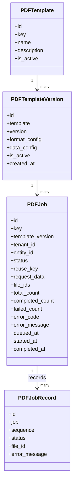
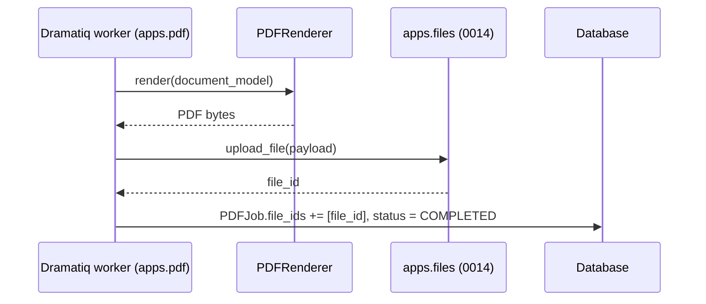

# 0016 — PDF Service (`apps.pdf`)

## Status

Proposed

## Context

Several Dristi flows need to produce documents — orders, summons, notices, certificates, case bundles and bulk registers. Rather than letting each module assemble its own PDF, this spec introduces a **generic, configuration-driven PDF module**, `apps.pdf`, that any other module can call.

The module is intentionally generic: it does not know what a "summons" or an "order" is. A caller supplies a configuration key plus request data, and the module produces a document.

Shape of the module:

* All PDF concerns live in one app: API, job persistence, data mapping, localization, QR, images, bulk handling and rendering.
* Rendering is **pure Python**, in-process. No external renderer service or additional runtime is introduced.
* Asynchronous work uses the project standard **Dramatiq**.
* **Configuration lives in the database**, not in files bundled with the code, so new document types can be added and refreshed without a deployment.
* Generated documents are **not stored by this module**. Persisting bytes and returning a document identifier is the responsibility of the File Storage Service described in [`0014`](0014-file-storage-service.md); `apps.pdf` only keeps the returned `file_id`.
* Because this module owns every PDF-format concern in the project, it also owns the **low-level signing primitives** — reserving a signature container, computing the ByteRange digest, and embedding a PKCS#7 blob — consumed by the eSign module in [`0015`](0015-cdac-esign.md) (#14). It does not orchestrate signing, hold keys, or talk to an ESP.

## Goals

* Provide REST APIs to create a PDF job, poll its status, and generate a document synchronously without storing it.
* Provide REST APIs to download and delete a document produced by this module.
* Persist job state (`PDFJob`) and per-record state for bulk jobs (`PDFJobRecord`) using the Django ORM.
* Store both the *format configuration* (document structure) and the *data configuration* (how request data is mapped into the structure) in the database, with versioning.
* Provide a declarative mapping toolkit: direct/JSONPath mapping, external API mapping, derived values, date formatting, localization, image mapping and QR mapping.
* Run generation in Dramatiq actors so that external API calls, image downloads, rendering and document persistence never block the HTTP request.
* Avoid regenerating an identical document, using a version-aware reuse key.
* Support bulk generation with chunking, fan-out, per-chunk status, merge, partial success, retry and cancellation.
* Delegate all document persistence, retrieval and deletion to `apps.files` per [`0014`](0014-file-storage-service.md).
* Provide synchronous, in-process PDF signature primitives (`prepare_for_signing`, `embed_signature`) for [`0015`](0015-cdac-esign.md), without owning any signing credential or ESP integration.

## Non-goals

* A rendering path outside Python — no external renderer process, sidecar service, or headless browser.
* eSign orchestration, signing keys/keystores, ESP protocols, Aadhaar/eKYC, or signature validation of existing documents. This module only exposes the PDF-format primitives in #14; everything else about signing belongs to [`0015`](0015-cdac-esign.md).
* Storing generated documents in this module's own tables or on local disk beyond transient temp files.
* A WYSIWYG template editor UI.
* Owning object storage, buckets, or storage paths (owned by `apps.files`).

---

## Proposed changes

### 1. App layout

Location: `apps.pdf` (registered as `"apps.pdf"` in `INSTALLED_APPS`).

```text
apps/pdf/
├── __init__.py
├── apps.py                     # name = "apps.pdf"
├── models.py                   # PDFTemplate, PDFTemplateVersion, PDFJob, PDFJobRecord
├── serializers.py
├── views.py
├── urls.py
├── admin.py
├── tasks.py                    # Dramatiq actors
├── services/
│   ├── __init__.py
│   ├── config_loader.py        # DB-backed config load + cache
│   ├── generator.py            # orchestration for one document
│   ├── bulk.py                 # chunking, fan-out, merge, aggregation
│   ├── reuse.py                # reuse-key computation / stale detection
│   ├── documents.py            # persistence via apps.files
│   ├── signing.py              # signature container + ByteRange hash + PKCS#7 embed (#14)
│   └── mapping/
│       ├── __init__.py         # DataMapper facade
│       ├── direct.py
│       ├── external_api.py
│       ├── derived.py
│       ├── qr.py
│       ├── image.py
│       ├── localization.py
│       └── formatting.py       # date/number/case transforms
├── renderer/
│   ├── __init__.py             # PDFRenderer interface
│   ├── python_renderer.py      # default pure-Python implementation
│   ├── fonts.py
│   └── merge.py                # merge / split
├── migrations/
└── tests/
```

Rules:

* Views only validate input, create/read jobs, and enqueue work. No mapping or rendering logic in views or serializers.
* Each mapping type is its own module with a narrow interface, so behaviour can be tested independently.
* The renderer never talks to the database, to `apps.files`, or to external services. It receives a resolved document model and returns bytes.

### 2. Data model



All models inherit `apps.core.models.BaseModel` (UUID primary key, `created_at`, `updated_at`, explicit `Meta.ordering`) per [`0000`](0000-api-coding-spec.md) #3. Bounded enums use `TextChoices`.

#### 2.1 `PDFTemplate` / `PDFTemplateVersion`

| Field                                 | Description                                                          |
| ------------------------------------- | -------------------------------------------------------------------- |
| `PDFTemplate.key`                     | Stable configuration key used by callers (`?key=`); unique           |
| `PDFTemplate.is_active`               | Whether the template can be used for new jobs                        |
| `PDFTemplateVersion.version`          | Monotonic integer, unique per template                               |
| `PDFTemplateVersion.format_config`    | `JSONField` describing document structure                            |
| `PDFTemplateVersion.data_config`      | `JSONField` describing how request data populates the structure      |
| `PDFTemplateVersion.is_active`        | Exactly one active version per template (enforced by constraint)     |

Storing configuration in the database satisfies the requirement that new document types can be introduced and refreshed without code deployment. Editing a configuration **creates a new version**; versions are immutable once used by a job, so an old job always describes what was actually rendered.

#### 2.2 `PDFJob`

| Field                | Description                                                            |
| -------------------- | ---------------------------------------------------------------------- |
| `id`                 | Job identifier returned to the caller                                  |
| `key`                | Configuration key requested                                            |
| `template_version`   | Version actually used for generation                                   |
| `tenant_id`          | Tenant that requested generation                                       |
| `entity_id`          | Optional business entity the document belongs to (searchable)          |
| `status`             | See #3                                                                 |
| `reuse_key`          | Deterministic hash used for regeneration avoidance (#7)                |
| `request_data`       | Request payload required by the worker, minus authorization headers    |
| `file_ids`           | `JSONField(list)` of `apps.files` file identifiers                     |
| `total_count`        | Number of documents/records expected (1 for single generation)         |
| `completed_count`    | Successfully generated records                                         |
| `failed_count`       | Failed records                                                         |
| `error_code`         | Short machine-readable failure reason                                  |
| `error_message`      | Safe, non-sensitive failure description                                |
| `queued_at` / `started_at` / `completed_at` | Lifecycle timestamps                            |

Indexes: `(tenant_id, key, entity_id)`, `(reuse_key)`, `(status)`.

`file_ids` holds **only** identifiers returned by `apps.files`. No bucket, key, path or URL is stored here.

#### 2.3 `PDFJobRecord`

One row per bulk chunk/record: `sequence`, `status`, `file_id`, `error_message`. Unique on `(job, sequence)`. Enables per-chunk retry, partial success reporting, and cancellation checks.

### 3. Job status lifecycle

```text
CREATED ──> QUEUED ──> PROCESSING ──> COMPLETED
                             │
                             ├──> PARTIAL_SUCCESS   (bulk: some records failed)
                             └──> FAILED

CREATED / QUEUED / PROCESSING ──> CANCELLED
```

* `PARTIAL_SUCCESS` is only reachable for bulk jobs with more than one record.
* Terminal states are `COMPLETED`, `PARTIAL_SUCCESS`, `FAILED`, `CANCELLED`.
* Transitions are performed through a small helper on the model so invalid transitions raise rather than silently overwrite.

### 4. APIs

Mounted under the versioned API namespace (`/api/v1/pdf/...`) per [`0000`](0000-api-coding-spec.md) #7, with `drf-spectacular` annotations and the `pdf` tag. All responses carry the standard `meta` envelope.

| Method | Path                          | Purpose                                            |
| ------ | ----------------------------- | -------------------------------------------------- |
| POST   | `/api/v1/pdf/jobs/`           | Create a generation job (async)                    |
| GET    | `/api/v1/pdf/jobs/`           | Search jobs by `entity_id`, `key`, `tenant_id`, `status` |
| GET    | `/api/v1/pdf/jobs/{id}/`      | Retrieve one job                                   |
| POST   | `/api/v1/pdf/jobs/{id}/cancel/` | Request cancellation                             |
| POST   | `/api/v1/pdf/render/`         | Synchronous render, returns bytes, nothing stored  |
| GET    | `/api/v1/pdf/jobs/{id}/download/` | Download a generated document                  |
| DELETE | `/api/v1/pdf/jobs/{id}/`      | Delete the job's generated documents               |

#### 4.1 Create job

```json
POST /api/v1/pdf/jobs/
{
  "key": "case-summons",
  "tenant_id": "kl",
  "entity_id": "case-123",
  "data": { "...": "caller supplied payload" },
  "force_regenerate": false
}
```

Response (`202 Accepted`):

```json
{
  "id": "job-uuid",
  "key": "case-summons",
  "tenant_id": "kl",
  "entity_id": "case-123",
  "status": "QUEUED",
  "file_ids": [],
  "total_count": 1,
  "created_at": "2026-09-22T10:30:00+05:30",
  "completed_at": null,
  "meta": { "...": "standard envelope" }
}
```

If an eligible completed job already exists for the computed reuse key and `force_regenerate` is false, the existing job is returned with `200 OK` and `reused: true`.

Flow:

```text
POST /api/v1/pdf/jobs/
        │
        ▼
Validate payload (serializer)
        │
        ▼
Resolve active PDFTemplateVersion for key
        │
        ▼
Compute reuse_key
        │
        ├── Reusable job found ──> return existing job (200, reused=true)
        │
        └── Not found
                │
                ▼
        Create PDFJob (CREATED -> QUEUED) inside transaction.atomic()
                │
                ▼
        Enqueue Dramatiq actor after commit
                │
                ▼
        Return job id (202)
```

#### 4.2 Search / retrieve job

`GET /api/v1/pdf/jobs/?entity_id=case-123` returns jobs for a business entity; `GET /api/v1/pdf/jobs/{id}/` returns a single job. Callers poll retrieve to learn when `file_ids` are available. List responses use the project default page-number pagination and `-created_at` ordering.

#### 4.3 Synchronous render

```json
POST /api/v1/pdf/render/
{
  "key": "case-summons",
  "tenant_id": "kl",
  "data": { "...": "" }
}
```

Returns `application/pdf` bytes. No `PDFJob` row is created and **nothing is sent to `apps.files`**. This endpoint exists for small, interactive, latency-tolerant documents only; it must enforce a hard timeout and reject configurations flagged as bulk-only or known to require external API fan-out. Limits are listed under open questions.

#### 4.4 Download and delete

Download and delete do not re-implement storage. They delegate to `apps.files`:

* Download resolves `PDFJob.file_ids` (or `PDFJobRecord.file_id` when `sequence` is supplied) and streams content obtained from the File Storage Service content accessor.
* Delete asks the File Storage Service to remove the referenced documents and then clears `file_ids` / marks the job as no longer downloadable.

Because [`0014`](0014-file-storage-service.md) currently lists deletion and content access as open items, this module depends on those being added there. Until they exist, `apps.pdf` must not delete objects directly from object storage — see #6.

### 5. Generation pipeline

The worker performs:

```text
PDFJob (QUEUED)
   │
   ▼
Re-load job, check status (idempotency / cancellation)
   │
   ▼
Load format_config + data_config from PDFTemplateVersion (cached)
   │
   ▼
Build render context via DataMapper
   │      ├── DirectMapper          (JSONPath, strings, arrays, columns, lists, labels, case transforms)
   │      ├── ExternalAPIMapper     (GET/POST, dynamic params, JSONPath on response)
   │      ├── DerivedMapper         (computed/functional values)
   │      ├── FormattingMapper      (dates, numbers)
   │      ├── LocalizationMapper    (tenant/module/locale lookups)
   │      ├── ImageMapper           (fetch + normalize images)
   │      └── QRMapper              (resolve value -> QR image)
   │
   ▼
Render template fragments (text placeholders)
   │
   ▼
Render document -> PDF bytes (PDFRenderer)
   │
   ▼
Merge / split if required
   │
   ▼
Persist via apps.files -> file_id           (see #6)
   │
   ▼
Update PDFJob (file_ids, counts, status, completed_at)
```

`DataMapper` is a facade:

```text
DataMapper.map(data_config, request_data, context) -> dict
```

Each sub-mapper handles exactly one declared mapping type and is unit tested in isolation with fixture configurations, so mapping behaviour is pinned by tests rather than implied by the renderer.

External API mapping uses the project's standard HTTP client with an explicit connect/read timeout, bounded retries (#10), and propagation of tenant/locale/correlation context (#12). It must never be given unbounded concurrency; per-job fan-out is capped by configuration.

### 6. Document persistence (File Storage Service integration)

This module does **not** implement storage. All generated bytes are handed to the File Storage Service defined in [`0014`](0014-file-storage-service.md), which owns object storage, metadata, tags and paths.



Rules for the integration:

* `apps.pdf` calls the in-process service functions `upload_file()`, `get_file()` and the content accessor described in [`0014`](0014-file-storage-service.md) #2/#6. It must not import `apps.files.storage` or touch the storage backend directly.
* Uploads are made with `file_type` = the PDF document type from the `FileType` enum, `user_id` = the requesting user or the system actor used for background generation, `organization_id` = the organization derived from request context when available.
* Tags are used to make generated documents discoverable, for example `pdf`, the template `key`, and the `entity_id`.
* The only thing persisted in `apps.pdf` is the returned `file_id` (in `PDFJob.file_ids` / `PDFJobRecord.file_id`). Buckets, keys and storage paths remain internal to `apps.files`.
* Download and delete in #4.4 are thin pass-throughs to the File Storage Service. Any capability `apps.pdf` needs and `0014` does not yet expose (content streaming, deletion) must be added to `apps.files` as a service function rather than re-implemented here.
* A job is only marked `COMPLETED` after `upload_file()` has returned a `file_id`. If the upload fails, the record/job fails (or retries per #10) and no `file_id` is recorded.
* Wherever a future iteration of `0014` gains a REST layer, `apps.pdf` still uses the service functions; it does not call the file APIs over HTTP.

### 7. Regeneration avoidance

Reuse is **version-aware** so that a configuration change makes older documents stale automatically.

```text
reuse_key = hash(
    tenant_id
    + key
    + entity_id
    + template_version.version
    + canonicalized significant request data
)
```

Behaviour:

* A new request that matches an existing `COMPLETED` job's `reuse_key` returns that job and its `file_ids` instead of generating again.
* A bumped `PDFTemplateVersion.version` changes the hash, so the document is regenerated on next request.
* `force_regenerate: true` always creates a new job.
* `CANCELLED`, `FAILED` and `PARTIAL_SUCCESS` jobs are never reused.
* Which request fields are "significant" is declared in `data_config`, so callers cannot accidentally break reuse with volatile fields such as timestamps.

### 8. Rendering

Rendering is defined behind an interface so the concrete library is an implementation detail:

```text
class PDFRenderer:
    def render(self, document, context) -> bytes
```

Requirements on the default pure-Python renderer:

* Text blocks, headings, styled runs, tables (including column widths and repeated headers), lists, images, QR images, page headers/footers, page breaks, margins and page size/orientation.
* Registered custom fonts, including the Indic fonts required by localized documents. Fonts are declared in a single `PDF_FONTS` mapping in `apps.pdf.renderer.fonts` and shipped with the app.
* Deterministic output for the same input, so tests can assert on structure.
* Merge and split operations for bulk and multi-part documents.

`format_config` is a **renderer-neutral document description** owned by this spec: it describes blocks, tables, styles and page setup, not the API of any particular rendering library. This keeps configurations portable if the rendering library is ever swapped. The formal `format_config` JSON schema is finalized during implementation and validated on save (#9). The specific Python rendering library is listed under open questions; the interface above keeps that choice reversible.

### 9. Configuration loading

```text
PDFConfigLoader.load(key) -> (format_config, data_config, template_version)
PDFConfigLoader.load_version(template_version_id)
```

* Configuration is read from the database, cached in the Django cache (Redis, per [`0012`](0012-redis-caching.md)) keyed by `template_version.id`.
* Cache entries are immutable because versions are immutable; activating a new version changes the lookup for `key`, so no manual invalidation of old entries is needed. The `key -> active version` lookup is invalidated on save.
* `format_config` and `data_config` are validated on save (admin/serializer level) so invalid configuration is rejected at authoring time rather than inside a worker.
* No runtime reload endpoint and no restart is required: adding or activating a version takes effect for new jobs immediately.

### 10. Background processing, idempotency and retry

Actors live in `apps/pdf/tasks.py`:

```text
generate_pdf(job_id)                 # single document
generate_bulk_pdf(job_id)            # plans chunks, fans out
generate_pdf_record(job_id, sequence)# one bulk chunk
finalize_bulk_pdf(job_id)            # merge + aggregate status
```

Rules:

* Enqueue **after** the database transaction commits, using `transaction.on_commit(...)`, so a worker never sees a missing row.
* Actors receive identifiers only. Large payloads stay in `PDFJob.request_data` / the database; they are never pushed through the broker.
* Actors are idempotent: they re-read the job, return immediately if it is already in a terminal state, and use `select_for_update` (or a status-conditional update) to claim work so duplicate deliveries do not produce duplicate documents.
* Retry is **dependency-specific**, not global:

  | Failure                                   | Behaviour                     |
  | ----------------------------------------- | ----------------------------- |
  | External API / localization timeout, 5xx  | Retry with backoff (bounded)  |
  | File Storage Service transient failure    | Retry with backoff (bounded)  |
  | Image download failure                    | Retry, then configurable fail or placeholder |
  | Database connectivity                     | Retry with backoff            |
  | Invalid configuration / schema error      | No retry, job `FAILED`        |
  | Invalid request data                      | No retry, job `FAILED`        |
  | Renderer error on valid config            | Retry once, then `FAILED`     |

* Exhausted retries move the job (or record) to `FAILED` with an `error_code` and a sanitized `error_message`.

### 11. Bulk generation

```text
Create bulk PDFJob
      │
      ▼
Split records by max-records-per-document
      │
      ├── PDFJobRecord 1 ──> generate_pdf_record
      ├── PDFJobRecord 2 ──> generate_pdf_record
      └── PDFJobRecord N ──> generate_pdf_record
      │
      ▼
finalize_bulk_pdf: merge if configured
      │
      ▼
Persist result(s) via apps.files
      │
      ▼
COMPLETED / PARTIAL_SUCCESS / FAILED
```

* `PDF_MAX_RECORDS_PER_DOCUMENT` controls chunking: 1000 records at 100 per document produces 10 chunks.
* Chunks run in parallel across Dramatiq workers, bounded by `PDF_BULK_MAX_PARALLEL_CHUNKS`.
* Each chunk updates its own `PDFJobRecord`, so a failed chunk can be retried without regenerating the whole job.
* If some chunks succeed and others exhaust retries, the parent job becomes `PARTIAL_SUCCESS` with `completed_count` / `failed_count` and the successfully produced `file_ids`. Whether merge should still happen for a partial job is listed under open questions.

### 12. Cancellation

* `POST /api/v1/pdf/jobs/{id}/cancel/` sets `status = CANCELLED` if the job is in `CREATED`, `QUEUED` or `PROCESSING`; terminal jobs return a conflict response.
* Workers check cancellation at chunk boundaries and before persisting output:

```text
if job.status == PDFJobStatus.CANCELLED:
    return
```

* Already-running chunks are allowed to finish their in-flight work but their output is not persisted and no further chunks are scheduled.
* Documents already persisted for a cancelled job are cleaned up through the File Storage Service delete path (#6).

### 13. Request context, authentication and security

* Endpoints follow the project authentication/permission baseline ([`0000`](0000-api-coding-spec.md) #6); generation endpoints require authentication.
* The module captures and propagates tenant id, user identity, locale and correlation/request id to external API calls, localization lookups and log records.
* Authorization headers/tokens are **never** persisted in `PDFJob.request_data`; the worker re-acquires service credentials from configuration.
* `error_message` must not contain tokens, full external payloads, or personal data.
* Rendered documents are treated as potentially sensitive: access goes through the job download endpoint and the File Storage Service, not through predictable public URLs.

### 14. Signing primitives (consumed by [`0015`](0015-cdac-esign.md))

Location: `apps.pdf.services.signing`. Two synchronous, in-process functions,
called directly by `apps.esign`:

```text
prepare_for_signing(document: bytes, placeholder: dict) -> PreparedDocument
embed_signature(prepared_document: bytes, pkcs7: bytes, field_name: str) -> bytes
```

`PreparedDocument` carries `prepared_document` (bytes), `document_hash` (hex
digest) and `field_name` (the signature field that was created).

Boundary rules:

* **No job, no storage, no key material.** These functions create no `PDFJob`
  row, never call `apps.files`, and never see a private key, certificate, PIN or
  ESP payload. Bytes in, bytes out. The caller stores the results and owns the
  transaction lifecycle.
* They are **not** exposed over REST. eSign is an in-process consumer; adding an
  HTTP surface would make a signing primitive publicly reachable for no benefit.
* They are independent of the template/rendering pipeline (#5) and of
  `format_config`: the input is an arbitrary existing PDF, not a rendered one.

#### 14.1 `prepare_for_signing`

1. Validate the input: parses as a PDF, not encrypted or password protected,
   within `PDF_MAX_SIGN_INPUT_BYTES`, and the requested page exists.
2. Create a signature field at the requested placement and reserve an empty
   signature container of `PDF_SIGNATURE_CONTAINER_BYTES`.
3. Compute the digest over the resulting PDF ByteRange using
   `PDF_SIGNATURE_HASH_ALGORITHM` and return it as a lowercase hex string.
4. Return the prepared bytes unchanged thereafter — the prepared document must be
   stored and later passed back verbatim, because the hash is only valid for
   those exact bytes.

`placeholder` schema (validated; unknown keys rejected):

```json
{
  "page": 1,
  "x": 380, "y": 60, "width": 160, "height": 60,
  "reason": "Approved",
  "location": "District Court, Ernakulam",
  "signer_name": "Presiding Officer"
}
```

A negative `page` addresses pages from the end (`-1` = last page). Coordinates
are in PDF points from the bottom-left of the page and must lie inside the page
box. The appearance drawn into the field is a simple text block built from
`signer_name`, `reason` and `location`; nothing is fetched or localized here.

#### 14.2 `embed_signature`

1. Validate that `prepared_document` contains exactly one empty reserved
   container matching `field_name`, and that `pkcs7` fits inside it.
2. Insert the PKCS#7 blob into the reserved container without re-writing or
   re-compressing any other byte, so the ByteRange digest stays valid.
3. Return the signed PDF bytes.

Rules:

* **Incremental update only.** If the document already carries signatures, they
  must remain valid; the module must never rewrite or flatten an already signed
  document.
* A PKCS#7 blob larger than the reserved container is an error, never a silent
  re-preparation — re-preparing would change the hash the ESP already signed.
* The function is pure and deterministic: the same prepared document and blob
  always produce the same output, which is what makes the eSign callback safe to
  replay.

#### 14.3 Errors

`PDFSigningError` subclasses, mapped by the caller to its own failure codes:
`PDFNotParsable`, `PDFEncrypted`, `PDFPageOutOfRange`, `PDFInvalidPlaceholder`,
`PDFSignatureFieldMissing`, `PDFSignatureContainerTooSmall`. Messages must not
include document content.

### 15. Configuration settings

New settings read in `config.settings.base` from environment variables, documented in `.env.example`, `.env.prod.example` (where required in production) and `README.md`:

```text
PDF_EXTERNAL_API_TIMEOUT_SECONDS
PDF_EXTERNAL_API_MAX_RETRIES
PDF_IMAGE_DOWNLOAD_TIMEOUT_SECONDS
PDF_IMAGE_MAX_BYTES
PDF_MAX_RECORDS_PER_DOCUMENT
PDF_BULK_MAX_PARALLEL_CHUNKS
PDF_SYNC_RENDER_TIMEOUT_SECONDS
PDF_CONFIG_CACHE_TIMEOUT_SECONDS
PDF_LOCALIZATION_BASE_URL
PDF_LOCALIZATION_CACHE_TIMEOUT_SECONDS
PDF_SIGNATURE_CONTAINER_BYTES
PDF_SIGNATURE_HASH_ALGORITHM
PDF_MAX_SIGN_INPUT_BYTES
```

Signing settings (#14):

| Setting | Default | Notes |
| --- | --- | --- |
| `PDF_SIGNATURE_CONTAINER_BYTES` | `16384` | reserved container size; must exceed the largest PKCS#7 blob the ESP returns, with margin |
| `PDF_SIGNATURE_HASH_ALGORITHM` | `SHA256` | must agree with the algorithm the consumer declares to its ESP ([`0015`](0015-cdac-esign.md) #11.1 enforces this via a system check) |
| `PDF_MAX_SIGN_INPUT_BYTES` | — | guard against signing very large PDFs in-process |

### 16. Observability

* Structured log lines per job with job id, key, template version, tenant, status transition and duration.
* Counters/timers for jobs created, reused, completed, failed, cancelled; per-dependency latency for external API, localization, render and file persistence.
* Slow-render and retry-exhaustion events logged at warning level with the `error_code`.
* Signing primitives log only the operation, page, container size and outcome — never document bytes, hashes of unrelated data, or PKCS#7 content.

### 17. Affected files

Initial implementation is expected to add:

```text
apps/pdf/__init__.py
apps/pdf/apps.py                     # name = "apps.pdf"
apps/pdf/models.py
apps/pdf/serializers.py
apps/pdf/views.py
apps/pdf/urls.py
apps/pdf/admin.py
apps/pdf/tasks.py
apps/pdf/services/*.py               # includes services/signing.py
apps/pdf/services/mapping/*.py
apps/pdf/renderer/*.py
apps/pdf/migrations/__init__.py
apps/pdf/tests/__init__.py
apps/pdf/tests/test_config_loader.py
apps/pdf/tests/test_direct_mapping.py
apps/pdf/tests/test_external_api_mapping.py
apps/pdf/tests/test_localization.py
apps/pdf/tests/test_qr_generation.py
apps/pdf/tests/test_image_mapping.py
apps/pdf/tests/test_renderer.py
apps/pdf/tests/test_reuse.py
apps/pdf/tests/test_signing.py
apps/pdf/tests/test_tasks.py
apps/pdf/tests/test_bulk.py
apps/pdf/tests/test_api.py
```

and to update:

```text
config/settings/base.py       # INSTALLED_APPS += ["apps.pdf"], PDF_* settings
config/urls.py                # include apps.pdf urls under /api/v1/
.env.example
.env.prod.example
README.md
```

The content accessor and delete function this module depends on are specified in [`0014`](0014-file-storage-service.md) #6.1/#6.2; if missing, they are added in `apps/files/services.py` as an amendment to that spec, not duplicated here.

### 18. Testing

* **Unit:** each mapper (direct/JSONPath, external API, derived, formatting, localization, image, QR), reuse-key computation, status transitions, config validation.
* **Renderer:** text, tables, images, QR, fonts, page breaks, headers/footers, merge and split.
* **Integration:** `create job -> worker -> apps.files -> job COMPLETED` with external services mocked and a fake/in-memory file storage backend.
* **API:** create (new and reused), search by job id and entity id, retrieve, cancel, synchronous render, download, delete; response shape including `meta`; authentication/permission behaviour; pagination on search.
* **Bulk:** below max records, exactly max records, above max records, multiple chunks, failed chunk, chunk retry, cancellation mid-run, partial success.
* **Failure:** file persistence failure leaves no `file_id` and no `COMPLETED` status; invalid configuration does not retry; duplicate task delivery produces exactly one document.
* **Signing (#14):** container reserved and hash computed over the ByteRange; hash is stable for the same prepared bytes and changes when the document changes; embedding produces a PDF whose signature verifies against the reserved ByteRange; an over-sized PKCS#7 is rejected rather than re-prepared; an already signed document keeps its earlier signature valid; encrypted PDF, non-PDF input, out-of-range page and invalid placeholder each raise the documented error; no `PDFJob` row and no `apps.files` call is made.

Quality checks before committing:

```bash
cd src && DJANGO_SETTINGS_MODULE=config.settings.test pytest
cd src && ruff check . && ruff format .
cd src && python manage.py check
```

---

## Design decisions

| #  | Decision              | Options                                          | Direction                                     |
| -- | --------------------- | ------------------------------------------------ | --------------------------------------------- |
| 1  | Rendering runtime     | In-process Python / external renderer process     | In-process Python only                        |
| 2  | Format config schema  | Library-specific dialect / renderer-neutral schema | Renderer-neutral schema owned by this spec    |
| 3  | Template engine       | Logic-less (Mustache-style) / Jinja2              | Jinja2 (Django-native)                        |
| 4  | Background processing | Celery / Dramatiq                                 | Dramatiq (project standard)                   |
| 5  | Config storage        | Files in repo / database                          | Database, versioned                           |
| 6  | Config reload         | Restart / dynamic                                 | Dynamic via new active version + cache        |
| 7  | DB access             | Raw SQL / ORM                                     | Django ORM                                    |
| 8  | Document storage      | Own storage / File Storage Service                | File Storage Service ([`0014`](0014-file-storage-service.md)) |
| 9  | Localization          | Direct integration / internal abstraction         | Internal service abstraction                  |
| 10 | Bulk processing       | Single task / fan-out                             | Fan-out with per-record rows                  |
| 11 | Regeneration          | Existence check / version-aware                   | Version-aware reuse key                       |
| 12 | Retry                 | Global / dependency-specific                      | Dependency-specific                           |
| 13 | Sync rendering        | Not offered / limited endpoint                    | Limited endpoint with hard timeout            |
| 14 | API contract          | RPC-style verbs / project REST conventions        | Project REST conventions                      |
| 15 | Signing primitives    | Owned by eSign / owned by this module             | This module (#14) — it already owns PDF bytes; eSign keeps keys and ESP flow |
| 16 | Signing surface       | REST endpoint / in-process functions              | In-process functions only                     |

---

## Open questions

1. Which Python rendering library should back `PythonRenderer`, given the required table, font and layout features?

2. What is the minimum viable `format_config` JSON schema for the first set of documents, and which layout features can be deferred?

3. Which module and document type is the first consumer, and does it need bulk generation on day one?

4. Which `FileType` enum value in [`0014`](0014-file-storage-service.md) should generated documents use, and which tags are mandatory?

5. Who is the `user_id` for documents generated by a background worker with no interactive user?

6. Does the File Storage Service need a content-streaming function, a signed URL, or both to support the download endpoint?

7. Deletion is out of scope in [`0014`](0014-file-storage-service.md) today — when will `delete_file()` be available, and should `apps.pdf` soft-delete jobs until then?

8. What are the realistic maximum bulk record counts, and what chunk size and parallelism follow from them?

9. For a bulk job with failed chunks, should the merged document be produced from the successful chunks or withheld until all chunks succeed?

10. Should a cancelled job's already-persisted documents be deleted immediately or retained for audit?

11. Which request fields count as "significant" for the reuse key, and should this be per template or global?

12. Should `PDFTemplateVersion` be editable through Django admin only, or should an authenticated configuration API be provided?

13. Which fonts and scripts must be supported initially, and where are the font files sourced and licensed from?

14. Should the synchronous render endpoint be allowed for configurations that require external API mapping at all, and what is its size/time limit?

15. Should `tenant_id` remain a plain string, or become a foreign key to an existing tenant/organization model?

16. Should localization values be cached per tenant/locale/module in Redis, and with what TTL?

17. What is the largest PKCS#7 blob the C-DAC ESP returns, so `PDF_SIGNATURE_CONTAINER_BYTES` can be fixed with margin? (Tracked as open question 5 in [`0015`](0015-cdac-esign.md).)

18. Does the chosen rendering/manipulation library support incremental update and ByteRange signing well enough for #14, or does signing need a second, purpose-specific PDF library?

19. Should signature appearance (#14.1) support an uploaded signature image in a later iteration, and would that image come from `apps.files`?

---

## Out of scope

* Any rendering runtime outside the Django process (external renderer service, headless browser).
* Object storage implementation, buckets, storage paths, and file metadata ownership.
* eSign orchestration, ESP integration, signing keys/keystores, and Aadhaar/eKYC (owned by [`0015`](0015-cdac-esign.md)).
* Verifying or validating signatures on existing documents, LTV, and timestamp-authority integration.
* A REST surface for the signing primitives in #14.
* A template authoring UI or visual designer.
* Non-PDF output formats (DOCX, XLSX, HTML export).
* Document watermarking and redaction.
* Long-term archival or retention policy for generated documents.
