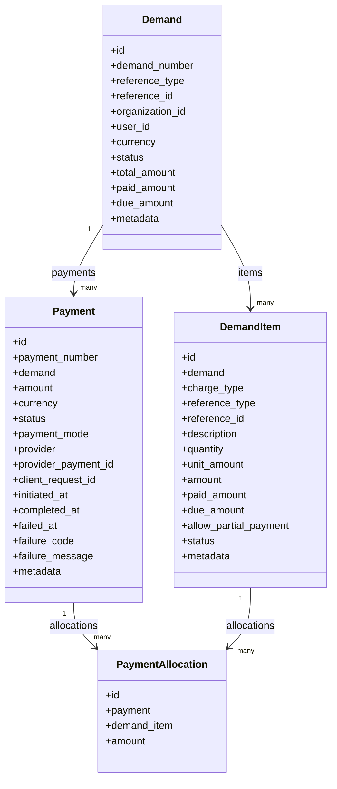

# 0017 — Payments Module (`apps.payments`)

## Status

Proposed

## Context

Several Dristi flows charge money: court fees on a filing, process fees
for summons, notices and warrants, application fees, advocate welfare fund
contributions. Today each of those flows would have to invent its own amount
tracking, its own "is it paid" flag and its own gateway integration.

This spec introduces one generic, domain-neutral module, `apps.payments`, that
owns the financial lifecycle of any payable charge raised by any other Dristi
module.

| Concept here | Meaning |
| --- | --- |
| `Demand` | A raised, payable claim — one or more charges grouped together |
| `DemandItem` | One independently payable charge (a line item) |
| `Payment` | One collection attempt against a demand |
| `PaymentAllocation` | What a payment actually pays, line item by line item |

### What the module does and does not decide

`apps.payments` knows amounts, currency, state and collection. It does **not**
know what a court fee is, how it is calculated, whether it is waived, or what
should happen in a case once it is paid. The raising module computes the amounts
and creates the demand; it is notified when collection succeeds.

Payment *providers* (gateways, bank/treasury integrations, counter collection)
are **out of this module** and ship separately as `addon.<provider>_payment_gateway`,
exactly as the SMS gateway does in [`0013`](0013-addon-cdac-sms-gateway.md). The
first implementation ships **no** concrete provider.

## Goals

* Create a demand with one or more line items in a single atomic operation.
* Keep an independent amount/paid/due/status balance per line item.
* Collect payment **line item wise**: pay exactly one item and leave the rest due.
* Collect payment **combined**: pay any chosen subset, or all payable items, in one payment.
* Support partial payment of a single line item where the raising module allows it.
* Record, for every payment, exactly which line items it paid and by how much.
* Derive demand status from its line items; never let an API client set balances.
* Make payment creation idempotent and safe under concurrent requests.
* Make payment confirmation idempotent, so a replayed callback never credits twice.
* Define a provider interface that an addon implements, with no gateway code in this module.
* Expose demand and payment REST APIs following [`0000`](0000-api-coding-spec.md).
* Notify the raising module when a demand or line item becomes fully paid.

## Non-goals

* Any concrete payment gateway, its SDK, credentials, checkout UI, webhook format or signature scheme.
* Fee calculation, fee schedules, exemptions, waivers and remission rules.
* Deciding whether a charge is payable, by whom, or by when.
* Refunds, reversals, settlement, reconciliation with bank statements, and receipts.
* Offline/cash counter collection in this iteration.
* Accounting ledgers, chart of accounts, heads of account and treasury posting.
* Multi-currency conversion. A demand is single-currency, defaulting to `INR`.

---

## Proposed changes

### 1. App layout

Location: `apps.payments` (registered as `"apps.payments"` in `INSTALLED_APPS`).

```text
apps/payments/
├── __init__.py
├── apps.py                 # name = "apps.payments"
├── models.py               # Demand, DemandItem, Payment, PaymentAllocation
├── enums.py                # TextChoices: statuses, charge types, reference types
├── serializers.py
├── views.py
├── urls.py
├── admin.py
├── exceptions.py
├── selectors.py            # read-only queries
├── tasks.py                # Dramatiq actors
├── services/
│   ├── __init__.py
│   ├── demands.py          # DemandService
│   ├── payments.py         # PaymentService
│   └── allocation.py       # balance application + demand recalculation
├── providers/
│   ├── __init__.py
│   ├── base.py             # PaymentProvider interface (#9)
│   └── registry.py         # settings-driven lookup, import_string
├── migrations/
└── tests/
```

Rules:

* Views validate input, call a service, and serialize the result. No balance arithmetic in views or serializers.
* Only `services/allocation.py` mutates `paid_amount`, `due_amount` and status. Every other module and every provider goes through `PaymentService`.
* `providers/` contains the interface and the registry only — never a gateway implementation.

### 2. Data model



All four models inherit `apps.core.models.BaseModel` (UUID pk, `created_at`, `updated_at`, `created_by`, `updated_by`, explicit `Meta.ordering`). 
Every bounded enum is a `TextChoices` in `apps/payments/enums.py`.

The shape that matters is `Payment → PaymentAllocation → DemandItem`. A payment
is a *collection transaction*; the allocation rows say what that transaction
actually pays. This single relationship is what makes line-item-wise payment,
combined payment and partial payment the same code path instead of three flows.

#### 2.1 `Demand`

| Field | Type | Notes |
| --- | --- | --- |
| `demand_number` | `CharField(32, unique=True)` | human-readable, e.g. `DMD-2026-000123` (#11) |
| `reference_type` | `CharField(32, choices=ReferenceType)` | what the demand is raised against (#3) |
| `reference_id` | `CharField(64, db_index=True)` | id of that entity, e.g. the case id |
| `organization_id` | `UUIDField(null=True, blank=True, db_index=True)` | plain identifier, not an FK — mirrors [`0014`](0014-file-storage-service.md) #1.1 |
| `user_id` | `UUIDField(null=True, blank=True, db_index=True)` | user or system expected to pay; plain identifier, not an FK — mirrors `organization_id` above; nullable for system-raised demands |
| `currency` | `CharField(3, default="INR")` | ISO 4217 |
| `status` | `CharField(16, choices=DemandStatus)` | derived, never client-set (#4) |
| `total_amount` | `DecimalField(18, 2)` | sum of non-cancelled item amounts |
| `paid_amount` | `DecimalField(18, 2)` | sum of item `paid_amount` |
| `due_amount` | `DecimalField(18, 2)` | `total_amount - paid_amount` |
| `due_date` | `DateTimeField(null=True, blank=True)` | informational; expiry is out of scope |
| `metadata` | `JSONField(default=dict, blank=True)` | caller context (court id, filing number, …) |

Indexes: `(reference_type, reference_id)`, `(status)`, `(user_id, status)`.

#### 2.2 `DemandItem`

| Field | Type | Notes |
| --- | --- | --- |
| `demand` | `FK(Demand, on_delete=PROTECT, related_name="items")` | parent |
| `charge_type` | `CharField(32, choices=ChargeType)` | kind of fee (#3) |
| `reference_type` | `CharField(32, choices=ReferenceType)` | what this specific charge is for — the summons, not the case (#3) |
| `reference_id` | `CharField(64, db_index=True)` | id of that entity, e.g. the summons id |
| `description` | `CharField(255)` | shown to the payer |
| `quantity` | `DecimalField(10, 2, default=1)` | `> 0` |
| `unit_amount` | `DecimalField(18, 2)` | `>= 0` |
| `amount` | `DecimalField(18, 2)` | `quantity * unit_amount`, computed server side |
| `paid_amount` / `due_amount` | `DecimalField(18, 2)` | maintained only by `services/allocation.py` |
| `allow_partial_payment` | `BooleanField(default=False)` | set by the raising module (#6.3) |
| `status` | `CharField(16, choices=DemandItemStatus)` | #4 |
| `metadata` | `JSONField(default=dict, blank=True)` | |

`description`, `quantity`, `unit_amount` and `amount` are a **snapshot** taken
when the demand is raised. A later change to the originating entity or to a fee
schedule must never silently change an existing demand; the raising module
cancels the item and raises a new one.

#### 2.3 `Payment`

| Field | Type | Notes |
| --- | --- | --- |
| `payment_number` | `CharField(32, unique=True)` | e.g. `PAY-2026-000456` |
| `demand` | `FK(Demand, on_delete=PROTECT, related_name="payments")` | a payment never spans two demands |
| `amount` | `DecimalField(18, 2)` | `> 0`; equals the sum of its allocations |
| `currency` | `CharField(3)` | copied from the demand, must match |
| `status` | `CharField(16, choices=PaymentStatus)` | #4 |
| `payment_mode` | `CharField(32, blank=True)` | `ONLINE`, `COUNTER`, … as reported |
| `provider` | `CharField(32, blank=True)` | addon name, empty until a provider is engaged |
| `provider_payment_id` | `CharField(128, blank=True)` | external id; unique per `provider` when non-empty |
| `client_request_id` | `CharField(128)` | caller-supplied id for this collection attempt; unique per demand, so a retried request returns the same payment instead of a second one (#7) |
| `initiated_at` / `completed_at` / `failed_at` | `DateTimeField` | lifecycle |
| `failure_code` | `CharField(64, blank=True)` | internal code, not a gateway code |
| `failure_message` | `TextField(blank=True)` | safe, user-presentable |
| `metadata` | `JSONField(default=dict, blank=True)` | non-sensitive provider context |

No gateway credential, signed request, raw callback body or card/VPA detail is
ever stored on this model.

#### 2.4 `PaymentAllocation`

| Field | Type | Notes |
| --- | --- | --- |
| `payment` | `FK(Payment, on_delete=PROTECT, related_name="allocations")` | |
| `demand_item` | `FK(DemandItem, on_delete=PROTECT, related_name="allocations")` | |
| `amount` | `DecimalField(18, 2)` | `> 0` |

Unique on `(payment, demand_item)`. Rows are written once, when the payment is
created, and are immutable thereafter (#10).

### 3. Reference types and charge types

Two bounded enums keep reporting possible without coupling this module to every
domain app.

`ReferenceType` — aligned with `EntityType` in [`0015`](0015-cdac-esign.md) #5:

```text
CASE
CASE_FILING
APPLICATION
SUMMONS
NOTICE
WARRANT
HEARING
ORDER            # judicial order, e.g. a cost ordered by the court
VAKALATNAMA
TASK
OTHER
```

`ChargeType`:

```text
COURT_FEE
FILING_FEE
PROCESS_FEE
SUMMONS_FEE
NOTICE_FEE
WARRANT_FEE
APPLICATION_FEE
ADVOCATE_WELFARE_FUND
COPY_FEE
PENALTY
OTHER_FEE
```

Rules:

* `reference_id` is a plain indexed `CharField`, never a foreign key, so `apps.payments` depends on no domain app and can be installed before them.
* New values are added to the enum with a migration. `OTHER`/`OTHER_FEE` exist so an early consumer is never blocked, not as a permanent home.
* The module attaches no behaviour to a `charge_type`. It is a label for reporting and for the raising module.

### 4. Status lifecycles

`DemandItemStatus` — the authoritative state:

```text
UNPAID ──partial allocation applied──> PARTIALLY_PAID ──remaining applied──> PAID
   │                                        │
   └────────────── cancelled ───────────────┴──> CANCELLED
```

* `PARTIALLY_PAID` is only reachable when `allow_partial_payment` is true.
* `CANCELLED` is reachable from `UNPAID` and `PARTIALLY_PAID` only. A `PAID` item cannot be cancelled — that is a refund, which is out of scope.
* A `CANCELLED` or `PAID` item can never appear in a new payment request.

`DemandStatus` — **derived** from the items, recomputed inside the same
transaction that applies an allocation:

| Item population | Demand status |
| --- | --- |
| No item has `paid_amount > 0` | `RAISED` |
| Some paid, at least one non-cancelled item still due | `PARTIALLY_PAID` |
| Every non-cancelled item is `PAID` | `PAID` |
| Every item is `CANCELLED`, or the demand was cancelled explicitly | `CANCELLED` |

`PaymentStatus`:

```text
INITIATED ──sent to provider──> PENDING ──confirmed──> SUCCESS
    │                              │
    │                              ├──> FAILED
    └──────────────────────────────┴──> CANCELLED
```

* `INITIATED` — payment and allocations exist; nothing has been collected.
* `PENDING` — handed to a provider, outcome awaited.
* `SUCCESS` — **the only state that increases any `paid_amount`**. Terminal.
* `FAILED` / `CANCELLED` — terminal; balances are untouched and the items become payable again.
* A terminal payment is never reused. A fresh attempt creates a new `Payment`, preserving the attempt history.

### 5. Collection modes

All three modes are the same API call with a different allocation list.

Demand `DMD-2026-000123` (`CASE`, case id `case-123`):

| Item | Charge type | Amount |
| --- | --- | --- |
| `item-1` | `SUMMONS_FEE` | ₹100.00 |
| `item-2` | `COURT_FEE` | ₹500.00 |
| `item-3` | `PROCESS_FEE` | ₹200.00 |

**Line item wise** — one payment per item:

```text
Payment P1  ₹100.00   allocations: item-1 → ₹100.00   demand → PARTIALLY_PAID
Payment P2  ₹500.00   allocations: item-2 → ₹500.00   demand → PARTIALLY_PAID
Payment P3  ₹200.00   allocations: item-3 → ₹200.00   demand → PAID
```

**Combined, selected subset**:

```text
Payment P4  ₹600.00   allocations: item-1 → ₹100.00, item-2 → ₹500.00
                      item-3 stays UNPAID, demand → PARTIALLY_PAID
```

**Combined, everything payable** ("pay all"):

```text
Payment P5  ₹800.00   allocations: item-1 → ₹100.00, item-2 → ₹500.00, item-3 → ₹200.00
                      demand → PAID
```

"Pay all" needs no special endpoint or flag — it is a payment whose allocations
cover every currently payable item. The demand reaches `PAID` identically in all
three modes; it does not record, and does not care, how many payments it took.

**Partial payment of one item** (`item-2`, `allow_partial_payment = true`):

```text
Payment P6  ₹200.00   item-2: paid 200, due 300, status PARTIALLY_PAID
Payment P7  ₹300.00   item-2: paid 500, due   0, status PAID
```

### 6. Services

#### 6.1 `DemandService`

```text
DemandService.raise_demand(*, reference_type, reference_id, items, user_id=None,
                           organization_id=None, currency="INR",
                           metadata=None) -> Demand
DemandService.cancel_demand(demand, *, reason) -> Demand
DemandService.cancel_item(demand_item, *, reason) -> DemandItem
```

`raise_demand` runs in one `transaction.atomic()`:

1. Validate the items (at least one; `quantity > 0`; `unit_amount >= 0`; known `charge_type`/`reference_type`).
2. Compute `amount = quantity * unit_amount` per item, and `total_amount` for the demand.
3. Allocate `demand_number` (#11).
4. Create the `Demand` and all `DemandItem` rows.
5. Set `paid_amount = 0`, `due_amount = total_amount`, `status = RAISED`.

Any invalid item fails the whole call; a partially created demand is never
visible. `paid_amount`, `due_amount` and `status` are never accepted from the
caller, in the service or in the serializer.

Cancellation refuses to touch a `PAID` item, recomputes the demand totals over
the remaining items, and fails if a payment for that item is currently
`INITIATED` or `PENDING`.

#### 6.2 `PaymentService`

```text
PaymentService.create_payment(*, demand, allocations, client_request_id,
                              payment_mode="", actor) -> Payment
PaymentService.mark_pending(payment, *, provider, provider_payment_id, metadata)
PaymentService.confirm_payment(payment, *, provider_payment_id="", metadata=None)
PaymentService.fail_payment(payment, *, failure_code, failure_message)
PaymentService.cancel_payment(payment, *, reason)
```

`create_payment` runs in one `transaction.atomic()`:

1. Return the existing payment unchanged if `(demand, client_request_id)` already exists (#7).
2. `select_for_update()` the demand and every referenced `DemandItem` (#8).
3. Validate each allocation against #6.3.
4. Sum the allocations into `Payment.amount`, copy `currency` from the demand.
5. Create the `Payment` (`INITIATED`) and its `PaymentAllocation` rows.
6. Enqueue `initiate_payment` with `transaction.on_commit(...)` when a provider is configured (#9, #12).

#### 6.3 Payment creation rules

1. At least one allocation; no duplicate `demand_item` in the list.
2. Every item belongs to the given demand.
3. The demand is `RAISED` or `PARTIALLY_PAID` — never `PAID` or `CANCELLED`.
4. Every item is `UNPAID` or `PARTIALLY_PAID` — never `PAID` or `CANCELLED`.
5. Each allocation amount is `> 0` and `<= demand_item.due_amount`.
6. An allocation smaller than `due_amount` requires `allow_partial_payment = true` on that item; otherwise the item must be paid in full in this payment.
7. `Payment.amount == sum(allocation.amount)`, and `amount > 0`.
8. Amounts carry at most two decimal places and are parsed as `Decimal`.
9. The item's due amount is computed from committed `SUCCESS` payments only; an in-flight `INITIATED`/`PENDING` payment over the same item is rejected (#8).

Each violation raises a typed exception in `apps/payments/exceptions.py`
(`DemandNotPayable`, `ItemNotPayable`, `AllocationExceedsDue`,
`PartialPaymentNotAllowed`, `DuplicateAllocation`, `PaymentInFlight`, …) mapped
by the view to a stable `400`/`409` response per [`0000`](0000-api-coding-spec.md) #9.

#### 6.4 Confirmation — applying allocations

`confirm_payment` is the **only** place where money is credited. It is
idempotent and fully transactional:

```text
BEGIN
  select_for_update(payment)
  if payment.status == SUCCESS: return payment          # replayed callback
  if payment.status not in (INITIATED, PENDING): raise PaymentNotConfirmable

  payment.status = SUCCESS; payment.completed_at = now()

  for allocation in payment.allocations:
      select_for_update(allocation.demand_item)
      item.paid_amount += allocation.amount
      item.due_amount   = item.amount - item.paid_amount
      item.status       = PAID if due_amount == 0 else PARTIALLY_PAID

  recompute demand.paid_amount / due_amount / status from its items   (#4)
COMMIT

transaction.on_commit -> notify_payment_completed(payment_id)          (#12)
```

A duplicate confirmation returns the already-successful payment without a second
credit. `fail_payment` and `cancel_payment` only move the payment to a terminal
state and touch no balance, so the items stay payable by a new payment.

### 7. Idempotency

* Clients send `client_request_id` in the create-payment body — a stable id they generate for one collection attempt. It is the idempotency key under a name that says who supplies it; the conventional `Idempotency-Key` header is also accepted and mapped onto the same field.
* `UniqueConstraint(fields=["demand", "client_request_id"])` enforces it in the database; the service catches `IntegrityError` and returns the existing payment with `200 OK` instead of `201 Created`. Application-level checking alone is not sufficient.
* Replaying a key with a *different* allocation list is a `409`, not a silent new payment.
* Provider callbacks are idempotent through the `SUCCESS` short-circuit in #6.4, plus `UniqueConstraint(fields=["provider", "provider_payment_id"])` for non-empty values.

### 8. Concurrency

Two clients paying the same ₹500 item at once must not both succeed:

```text
Request A: select_for_update(item) → due 500 → creates payment  → commit
Request B: blocks on the lock → re-reads item → in-flight/zero due → rejected
```

Rules:

* `create_payment` locks the demand and the referenced items with `select_for_update()` before reading any balance, so the due amount it validates against cannot change under it.
* `confirm_payment` locks the payment first, then each item, in a stable order (by `demand_item_id`) to avoid deadlocks.
* An item with an `INITIATED` or `PENDING` payment is not re-payable; the client cancels or lets the in-flight payment fail first. This keeps the model honest without a separate "reserved amount" column.
* SQLite (`config.settings.test`) ignores `select_for_update()`; concurrency tests therefore assert the database constraints and the re-read checks, which hold on both backends.

### 9. Provider boundary

The module defines the interface; addons implement it.

```python
# apps/payments/providers/base.py
class PaymentProvider:
    name: str

    def initiate(self, payment: Payment) -> ProviderInitiation: ...
    def fetch_status(self, payment: Payment) -> ProviderStatus: ...
    def parse_callback(self, request) -> ProviderCallback: ...
```

* `ProviderInitiation` carries `provider_payment_id`, an optional `redirect_url`/`checkout_payload` returned to the client, and non-sensitive `metadata`.
* `ProviderStatus` and `ProviderCallback` carry a normalized `PaymentStatus`, the `provider_payment_id`, an optional failure code/message and non-sensitive `metadata`.
* Providers are resolved by `settings.PAYMENT_PROVIDERS` (a name → dotted-path map) through `import_string`, exactly like `MESSAGING_BACKENDS` in [`0013`](0013-addon-cdac-sms-gateway.md). `PAYMENT_DEFAULT_PROVIDER` selects the default.

Dependency direction:

```text
addon.<provider>_payment_gateway  ── imports ──>  apps.payments.providers.base
apps.payments                     ── never imports ──> addon.*
config.settings.base              ── references ──> "addon.<x>.provider.XProvider"
```

A provider addon may expose its own callback/webhook URL, but that view **must
not** touch `Demand`, `DemandItem` or balances. It verifies the request, maps it
to a `ProviderCallback`, and calls `PaymentService.confirm_payment` /
`fail_payment`. `PaymentService` stays the single writer of payment state.

With no provider configured, demands and payments still work end to end: a
payment stays `INITIATED` until an operator or an internal service confirms it
through `PaymentService`, which is what the first iteration and the tests use.

### 10. Immutability

Once a payment is `SUCCESS`:

* Its `amount`, its allocation rows and the `amount` of every allocated `DemandItem` are frozen. The model's `save()`/`clean()` rejects such changes, and the admin exposes them read-only.
* Correction is a new business operation (refund, fresh demand) — never an edit of history. Refunds are out of scope here.
* State changes on `Demand`, `DemandItem` and `Payment` are recorded through the project's existing history mechanism ([`0004`](0004-simple-audit-history.md)); this module adds no parallel event table.

### 11. Numbering

`demand_number` and `payment_number` are human-readable, unique and
monotonic per year: `DMD-{YYYY}-{seq:06d}`, `PAY-{YYYY}-{seq:06d}`.

Generation uses a database sequence/counter row inside the creating transaction
(not `max(...) + 1`), so concurrent creation cannot collide; the `unique=True`
constraint is the backstop.

### 12. APIs

Mounted under `/api/v1/payments/` per [`0000`](0000-api-coding-spec.md) #7, with
`drf-spectacular` annotations, the `payments` tag and the standard `meta`
envelope on every response.

| Method | Path | Purpose |
| --- | --- | --- |
| POST | `/api/v1/payments/demands/` | Raise a demand with its line items |
| GET | `/api/v1/payments/demands/` | List demands; filters `reference_type`, `reference_id`, `status`, `user_id`, `organization_id` |
| GET | `/api/v1/payments/demands/{id}/` | Retrieve a demand with items and payment summary |
| POST | `/api/v1/payments/demands/{id}/cancel/` | Cancel a demand |
| POST | `/api/v1/payments/demands/{id}/items/{item_id}/cancel/` | Cancel one line item |
| POST | `/api/v1/payments/demands/{id}/payments/` | Create a payment for selected items |
| GET | `/api/v1/payments/demands/{id}/payments/` | Payment history for a demand |
| GET | `/api/v1/payments/payments/{id}/` | Retrieve a payment with its allocations |
| POST | `/api/v1/payments/payments/{id}/cancel/` | Cancel a non-terminal payment |

List endpoints use the project default page-number pagination and `-created_at`
ordering. There is no endpoint that sets a status or a balance directly.

#### 12.1 Raise a demand

```json
POST /api/v1/payments/demands/
{
  "reference_type": "CASE",
  "reference_id": "case-123",
  "currency": "INR",
  "items": [
    {
      "charge_type": "SUMMONS_FEE",
      "reference_type": "SUMMONS",
      "reference_id": "summons-987",
      "description": "Process fee for summons to respondent",
      "quantity": 1,
      "unit_amount": "100.00"
    },
    {
      "charge_type": "COURT_FEE",
      "reference_type": "CASE_FILING",
      "reference_id": "filing-456",
      "description": "Court fee on filing",
      "quantity": 1,
      "unit_amount": "500.00",
      "allow_partial_payment": true
    }
  ],
  "metadata": { "court_id": "court-kl-ekm-01" }
}
```

`201 Created` returns the demand with server-computed `demand_number`,
`total_amount`, `due_amount`, `status` and the created items.

#### 12.2 Create a payment

```json
POST /api/v1/payments/demands/{id}/payments/
{
  "client_request_id": "case-123-summons-fee-attempt-1",
  "payment_mode": "ONLINE",
  "allocations": [
    { "demand_item_id": "item-1", "amount": "100.00" },
    { "demand_item_id": "item-2", "amount": "500.00" }
  ]
}
```

`201 Created`:

```json
{
  "id": "payment-uuid",
  "payment_number": "PAY-2026-000456",
  "demand_id": "demand-uuid",
  "amount": "600.00",
  "currency": "INR",
  "status": "INITIATED",
  "provider": "",
  "allocations": [
    { "demand_item_id": "item-1", "amount": "100.00" },
    { "demand_item_id": "item-2", "amount": "500.00" }
  ],
  "meta": { "...": "standard envelope" }
}
```

A single-element `allocations` list is line-item-wise collection; a list
covering every payable item is "pay all". When a provider is configured, the
response also carries the provider's `redirect_url`/`checkout_payload` under
`provider_action`, which this module passes through without interpreting.

#### 12.3 Serializer responsibilities

Serializers validate payload shape only: required fields, UUID formats, decimal
format and scale, known enum values, non-empty and duplicate-free allocation
lists, currency format. Ownership, payability, due amounts and balances are
checked in the service under a lock (#6.3), because a serializer cannot hold a
row lock. `paid_amount`, `due_amount`, `status`, `*_number`, `provider*` and all
timestamps are `read_only_fields`.

### 13. Permissions

* Baseline from [`0000`](0000-api-coding-spec.md) #6: `IsAuthenticatedAndRegistered`. There is no anonymous demand or payment endpoint.
* A user may read a demand if they are its `user_id`, or they hold the model permission for the owning organization; creating a payment requires the same access as reading the demand.
* Raising and cancelling demands is for internal modules (in-process service calls) and staff with `payments.add_demand` / `payments.cancel_demand`. The REST create endpoint is not for ordinary payers.
* Provider callback endpoints live in the addon and authenticate by provider signature, not by session.

### 14. Background processing

Dramatiq actors in `apps/payments/tasks.py`, Redis broker
([`0012`](0012-redis-caching.md)):

```text
initiate_payment(payment_id)            # call provider.initiate, store provider ids, → PENDING
poll_payment_status(payment_id)         # provider.fetch_status for stuck PENDING payments
notify_payment_completed(payment_id)    # inform the raising module / messaging
```

Rules:

* Enqueued with `transaction.on_commit(...)` so a worker never sees a missing row.
* Actors take identifiers only; payloads stay in the database.
* Actors are idempotent: they re-read the payment and return immediately if it is already terminal.
* Retry is dependency-specific: provider timeouts and 5xx retry with bounded backoff; a provider rejection or a validation error does not retry and moves the payment to `FAILED` with a `failure_code`.
* `notify_payment_completed` must not re-apply balances; it only publishes the outcome.

### 15. Data integrity

Database constraints:

| Model | Constraint |
| --- | --- |
| `Demand` | `demand_number` unique |
| `Demand` | `total_amount >= 0`, `paid_amount >= 0`, `due_amount >= 0`, `paid_amount <= total_amount` |
| `DemandItem` | `quantity > 0`, `unit_amount >= 0`, `amount >= 0`, `paid_amount >= 0`, `due_amount >= 0`, `paid_amount <= amount` |
| `Payment` | `payment_number` unique; `amount > 0` |
| `Payment` | unique `(demand, client_request_id)` |
| `Payment` | unique `(provider, provider_payment_id)` where both are non-empty |
| `PaymentAllocation` | unique `(payment, demand_item)`; `amount > 0` |

Enforced in the service layer (not expressible as a single-row check):

```text
sum(allocation.amount for a payment) == payment.amount
sum(SUCCESS allocations for an item)  == item.paid_amount
item.due_amount                        == item.amount - item.paid_amount
demand.total/paid/due                  == aggregates over non-cancelled items
```

A management command `payments_verify_balances` recomputes these aggregates and
reports drift; it is read-only.

### 16. Money handling

* Every monetary field is `DecimalField(max_digits=18, decimal_places=2)`. `FloatField` is prohibited for money, in models, serializers and tests.
* Amounts cross the API as **strings**, never JSON numbers, to avoid float coercion by clients.
* Arithmetic uses `Decimal` with `ROUND_HALF_UP` quantization to two places; rounding happens once, when an item amount is computed, never while allocating.
* `currency` is stored explicitly on both `Demand` and `Payment` and must match. Mixed-currency demands are rejected.

### 17. Settings

Read in `config.settings.base` from environment variables, documented in
`.env.example`, `.env.prod.example` and `README.md`:

```text
PAYMENT_PROVIDERS                  # {"<name>": "addon.<x>.provider.XProvider"}
PAYMENT_DEFAULT_PROVIDER           # "" in the first iteration
PAYMENT_DEFAULT_CURRENCY           # INR
PAYMENT_PROVIDER_TIMEOUT_SECONDS
PAYMENT_PROVIDER_MAX_RETRIES
PAYMENT_STATUS_POLL_INTERVAL_SECONDS
PAYMENT_PENDING_TIMEOUT_MINUTES    # after which a PENDING payment is polled/failed
```

### 18. Affected files

Adds:

```text
apps/payments/__init__.py
apps/payments/apps.py
apps/payments/enums.py
apps/payments/models.py
apps/payments/serializers.py
apps/payments/views.py
apps/payments/urls.py
apps/payments/admin.py
apps/payments/exceptions.py
apps/payments/selectors.py
apps/payments/tasks.py
apps/payments/services/{__init__,demands,payments,allocation}.py
apps/payments/providers/{__init__,base,registry}.py
apps/payments/migrations/__init__.py
apps/payments/tests/{__init__,test_models,test_demand_service,test_payment_service,
                     test_allocation,test_idempotency,test_concurrency,test_tasks,test_api}.py
```

Updates:

```text
config/settings/base.py       # INSTALLED_APPS += ["apps.payments"], PAYMENT_* settings
config/urls.py                # include apps.payments urls under /api/v1/
.env.example
.env.prod.example
README.md
```

### 19. Testing

* **Demand:** single item; multiple items; empty item list rejected; `quantity <= 0` and negative `unit_amount` rejected; `amount`/`total_amount` computed correctly; client-supplied `status`/`paid_amount` ignored; item and demand cancellation; cancellation of a `PAID` item rejected.
* **Line item wise collection:** pay one item, assert that item is `PAID`, the others `UNPAID`, and the demand `PARTIALLY_PAID`; pay the remaining items one by one until the demand is `PAID`.
* **Combined collection:** pay a chosen subset in one payment; pay all payable items in one payment and assert the demand becomes `PAID` with exactly one payment row.
* **Equivalence:** a demand paid item-wise and an identical demand paid combined end in the same balances and status.
* **Partial payment:** two partial payments on an `allow_partial_payment` item; partial allocation rejected when the flag is false; over-allocation beyond `due_amount` rejected.
* **Validation:** item from another demand; duplicate item in one request; cancelled or already-paid item; empty allocation list; `amount <= 0`; mismatched currency; payment against a `PAID`/`CANCELLED` demand.
* **Idempotency:** same key returns the same payment with `200` and creates no second row; same key with different allocations is a conflict; duplicate `confirm_payment` credits exactly once.
* **Concurrency:** two creations over the same item leave at most one payable; a second payment over an in-flight item is rejected.
* **State:** `SUCCESS` updates item and demand balances; `FAILED`/`CANCELLED` leave balances untouched and the item re-payable; confirming a terminal payment raises.
* **Provider:** a fake provider addon drives initiate → pending → confirm and initiate → failure; unknown provider name; provider timeout retry; a callback that tries to write a balance directly is impossible because the write path is `PaymentService` only.
* **API:** success paths, permissions, `meta` envelope, pagination, filters, read-only field enforcement, error shapes.

Quality checks before committing:

```bash
cd src && DJANGO_SETTINGS_MODULE=config.settings.test pytest
cd src && ruff check . && ruff format .
cd src && python manage.py check
```

---

## Design decisions

| # | Decision | Options | Direction |
| --- | --- | --- | --- |
| 1 | Naming | `Order`/`OrderItem` / `Demand`/`DemandItem` | `Demand` — `Order` means a judicial order in eCourt |
| 2 | Payment ↔ item link | Payment per item / payment per demand / allocation table | Allocation table — one path for item-wise, combined and partial collection |
| 3 | Domain coupling | FKs to case/summons apps / `reference_type` + `reference_id` | Enum type + plain id, like [`0015`](0015-cdac-esign.md) |
| 4 | Demand status | Stored and set by callers / derived from items | Derived, recomputed in the crediting transaction |
| 5 | Partial payment | Always / never / per item flag | Per item `allow_partial_payment`, set by the raising module |
| 6 | Gateway code | In this module / separate addon | Addon (`addon.<x>_payment_gateway`), none in the first iteration |
| 7 | Idempotency | Application check / database constraint | Unique `(demand, client_request_id)` constraint |
| 8 | Concurrency | Optimistic version / row locks | `select_for_update()` on demand and items |
| 9 | In-flight items | Reserved-amount column / reject second payment | Reject while a payment is `INITIATED`/`PENDING` |
| 10 | Money type | `FloatField` / `DecimalField` | `DecimalField(18, 2)`, strings on the wire |
| 11 | Audit of state changes | New `PaymentEvent` table / project history | Project history ([`0004`](0004-simple-audit-history.md)) |
| 12 | App split | `apps.orders` + `apps.payments` / one app | One app — the two models share every transaction |
| 13 | Background jobs | Celery / Dramatiq | Dramatiq, Redis broker (project standard) |
| 14 | Corrections | Edit successful payments / new operation | Successful payments are immutable |

---

## Open questions

1. Who is the first consumer — court fee on filing, or process fee for summons — and does it need partial payment on day one?
2. Should a demand be payable by someone other than its `user_id` (an advocate paying for a litigant), and how is that authorized?
3. Is `organization_id` sufficient scoping, or does a demand need an explicit court/establishment identifier of its own?
4. Which provider will be integrated first, and does it support per-line-item breakup in its own checkout, or only a single total?
5. Should demands expire — a `due_date` that auto-cancels unpaid items — or is expiry owned by the raising module?
6. Is a receipt document (via [`0016`](0016-pdf-services.md)) part of this module's completion flow or the raising module's?
7. How are counter/offline collections recorded: a `COUNTER` payment mode confirmed by a cashier role, or a separate addon?
8. Should `notify_payment_completed` publish a generic signal/event, or call a registered per-`reference_type` handler?
9. Do any charges need tax or component breakup (base + cess) inside a single line item, or is one item per component sufficient?
10. What is the retention policy for terminal failed payments?

---

## Out of scope

* Any concrete payment gateway, bank, UPI or treasury integration.
* Refunds, reversals, chargebacks and settlement/reconciliation with bank statements.
* Fee schedules, calculation, exemption, waiver and remission.
* Receipts, challans and accounting/ledger posting.
* Offline/cash counter collection in this iteration.
* Multi-currency demands and currency conversion.
* Payment reminders, dunning and auto-expiry of demands.
* Provider failover and multi-provider routing policy.
