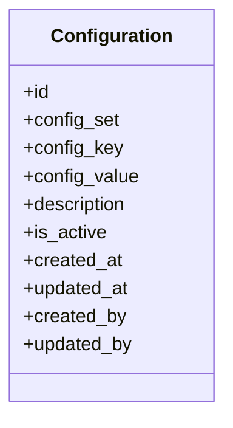

# 0018 — Configuration Store (`apps.configuration`)

## Status

Proposed

## Context

Several Dristi modules need small operational values that change without a code
deployment: how many records fit into one generated PDF, how long a payment link
stays valid, which sender ID the SMS gateway uses. Today each module would either
hardcode these or add yet another environment variable, which forces a redeploy
and spreads the same pattern across apps.

This spec introduces a **generic, non-sensitive key/value configuration store**,
`apps.configuration`, owned by no particular domain and consumed in-process by all
of them.

Example:

| `config_set` | `config_key` | `config_value` |
| --- | --- | --- |
| `pdf` | `max_records_per_pdf` | `100` |
| `pdf` | `default_template` | `court_notice` |
| `payment` | `payment_expiry_minutes` | `30` |
| `sms` | `sender_id` | `DRISTI` |

The module is intentionally dumb: it stores strings and returns strings. It does
not know what `max_records_per_pdf` means, and it MUST NOT grow conditional logic.

**This iteration does not expose any REST API.** The module is consumed in-process
through service-level functions only. A thin DRF layer MAY be added later on top
of the same functions.

## Goals

* Provide a single table for non-sensitive, runtime-editable configuration values.
* Guarantee uniqueness of `config_set` + `config_key`.
* Expose a small service interface for reading a single entry and a whole set.
* Return only **active** configuration to consumers.
* Allow configuration to be edited through Django admin without a deployment.
* Keep values opaque strings, with typed coercion helpers at the read boundary.
* Keep reads cheap enough to be called inside request paths.

## Non-goals

* Storing secrets, passwords, API keys, tokens, or private keys.
* Replacing environment variables for infrastructure wiring (DB URL, broker URL).
* A typed/validated schema per key in this iteration (see #2.2).
* REST/HTTP APIs, serializers, viewsets, or URL routing in this iteration.
* Per-organization or per-tenant configuration overrides (see #10).
* Rule evaluation, conditionals, expressions, or templating of any kind.
* Change approval workflows.

---

## Proposed changes

### 1. Data model

Location: `apps.configuration.models`



`Configuration` MUST inherit `apps.core.models.BaseModel` (UUID primary key,
`created_at`, `updated_at`, `created_by`, `updated_by`, explicit `Meta.ordering`)
and `apps.core.models.BaseActivatableModel` (`is_active` plus the `active()`
queryset helper). Audit fields are
therefore FKs to `AUTH_USER_MODEL`, not strings.

### 1.1 Fields

| Field | Type | Description |
| --- | --- | --- |
| `id` | UUID | Primary key, from `BaseModel` |
| `config_set` | `CharField` | Namespace of the entry; required |
| `config_key` | `CharField` | Key within the set; required |
| `config_value` | `TextField` | Opaque value; required, MAY be empty string |
| `description` | `TextField` | Human note on what the entry controls; nullable |
| `is_active` | `BooleanField` | From `BaseActivatableModel`; default `True` |
| `created_at` / `updated_at` | datetime | From `BaseModel` |
| `created_by` / `updated_by` | FK user, nullable | From `BaseModel` |

`description` is nullable but SHOULD be filled: it is the only documentation an
operator sees in admin.

### 1.2 Constraints and normalization

* A `UniqueConstraint` on (`config_set`, `config_key`) MUST exist.
* `config_set` and `config_key` MUST be normalized on save: trimmed and lowercased.
  Uniqueness is therefore effectively case-insensitive, so `PDF`/`pdf` cannot
  create two entries.
* `config_set` and `config_key` SHOULD be validated against
  `^[a-z0-9_]+(\.[a-z0-9_]+)*$` so that keys stay machine-friendly and dotted
  grouping (`gateway.cdac.timeout`) remains possible.
* `Meta.ordering` MUST be explicit; `("config_set", "config_key")` is preferred
  over the `BaseModel` default because this table is read as a sorted catalogue.
* Indexes: the unique constraint covers the lookup by set+key; an index on
  `config_set` MUST exist to support `get_set()`.

Uniqueness is enforced on the full row regardless of `is_active`. Deactivating an
entry does **not** free its key — an operator reactivates it instead of creating a
duplicate.

### 2. Value semantics

#### 2.1 Opaque storage

`config_value` is stored as text. The module MUST NOT attempt to infer a type.

#### 2.2 No `config_type` in this iteration

A `config_type` column is deliberately omitted. The store is a generic key/value
map and the consumer already knows the type it expects. Typed configuration MAY be
introduced later, explicitly, if real demand appears — adding a nullable column is
cheaper than removing a half-used one.

To keep callers from re-implementing parsing, the service layer MUST provide
coercion helpers rather than a stored type.

#### 2.3 Non-sensitive only

Secrets MUST NOT be stored in this module. This includes passwords, API keys,
tokens, private keys, and anything that would be redacted in a log.

Rationale: rows here are editable in Django admin, cacheable, dumpable in
fixtures, and intentionally readable by every module in the process. Secrets stay
in environment variables / the deployment secret store.

Enforcement is by convention and review in this iteration. A key-name denylist
(`*_secret`, `*_password`, `*_key`, `*_token`) MAY be added as a model validator;
see.

### 3. Service interface

Location: `apps.configuration.services`

Consumers MUST access configuration through this interface and MUST NOT query
`Configuration.objects` directly. This keeps the active-only rule, caching, and
defaults in one place.

```text
get(config_set, config_key, default=_UNSET)      -> str
get_set(config_set)                              -> dict[str, str]
get_int(config_set, config_key, default=_UNSET)  -> int
get_bool(config_set, config_key, default=_UNSET) -> bool
get_json(config_set, config_key, default=_UNSET) -> Any
```

#### 3.1 `get()` and `get_set()`

```python
ConfigurationService.get(
    config_set="payment",
    config_key="payment_expiry_minutes",
)

ConfigurationService.get_set("payment")
```

Rules:

* Only rows with `is_active=True` are visible. An inactive row is indistinguishable
  from a missing row.
* `get()` with no `default` MUST raise `ConfigurationNotFound` for a missing or
  inactive key. It MUST NOT return `None` silently.
* `get()` with an explicit `default` returns that default instead of raising.
  `None` is a legitimate default and MUST be distinguishable from "no default
  given" (hence the `_UNSET` sentinel).
* `get_set()` returns a `dict[config_key, config_value]` for the active rows of a
  set, and an empty dict for an unknown set — an unknown set is not an error,
  because "no overrides configured" is a normal state.
* Lookup arguments are normalized the same way as stored values, so
  `get("PDF", "Max_Records_Per_PDF")` resolves.

#### 3.2 Coercion helpers

`get_int`, `get_bool`, and `get_json` wrap `get()` and parse the string.

* A value that fails to parse MUST raise `ConfigurationValueError`, not fall back
  to the default. A malformed value is an operator mistake and must be loud; a
  missing value is a normal state and uses the default.
* `get_bool` MUST accept `true/false`, `1/0`, `yes/no`, `on/off`,
  case-insensitively, and reject everything else.

#### 3.3 Style

* The service functions are plain Python callables returning plain Python values.
* They MUST NOT depend on request/response objects, DRF, or HTTP status codes.
* Errors are raised as Python exceptions; a future REST layer translates them.

### 4. Caching

This table is read-heavy and very low-churn, which is exactly the profile
[`0012`](0012-redis-caching.md) targets.

* `configuration_configuration` SHOULD be added to the cachalot allow-list
  (`CACHALOT_ONLY_CACHABLE_TABLES`) so reads are served from Redis and writes
  invalidate automatically.
* The service layer MUST NOT add a second, hand-rolled cache on top in this
  iteration. One invalidation mechanism is enough; a module-level dict cache would
  survive admin edits and is the classic source of "I changed it but nothing
  happened".
* Consumers MUST read configuration at the point of use, not at import time.
  Module-level constants defeat runtime editability.

### 5. Seeding and defaults

* Every consuming module MUST pass an explicit `default` or document the key as
  required.
* Known keys SHOULD be seeded via a data migration or a `loadconfig` management
  command so a fresh environment boots with sane values.
* A missing key MUST NOT crash a request path when a sensible default exists.

### 6. Admin

Location: `apps.configuration.admin`

* `Configuration` MUST be registered with `list_display` of `config_set`,
  `config_key`, `config_value`, `is_active`, `updated_at`.
* `list_filter` on `config_set` and `is_active`; `search_fields` on `config_key`
  and `description`.
* `created_by` / `updated_by` MUST be read-only and populated from the request user.
* Admin is the primary editing surface in this iteration.

### 7. Validation and error handling

| Condition | Behavior |
| --- | --- |
| Duplicate (`config_set`, `config_key`) | `IntegrityError` / `ValidationError` from the unique constraint |
| Invalid set/key format | `django.core.exceptions.ValidationError` in `clean()` |
| Missing/inactive key, no default | `ConfigurationNotFound` |
| Unparseable value in a coercion helper | `ConfigurationValueError` |

Both module exceptions SHOULD derive from a common `ConfigurationError` base so
callers can catch broadly.

### 8. Testing

Required coverage:

* Unique constraint on (`config_set`, `config_key`), including the case-normalized
  collision (`PDF`/`pdf`).
* Set/key normalization and format validation.
* `get()` success, missing key raising, missing key with default, inactive key
  treated as missing, `None` as an explicit default.
* `get_set()` for a populated set, a set with a mix of active/inactive rows, and
  an unknown set.
* `get_int` / `get_bool` / `get_json` success and `ConfigurationValueError` on bad
  input, including that a bad value does **not** fall back to the default.
* Admin stamps `created_by` / `updated_by`.

---

## 9. Open questions

1. Should a key-name denylist (#2.3) be enforced as a model validator, or left to
   review?
2. Do we need per-organization overrides (`organization_id` nullable, resolution
   order org → global)? Adding the column later forces a backfill of the unique
   constraint.
3. Should `config_set` be a free string or a `TextChoices` enum owned by the
   module? An enum prevents typos but requires a code change per new consumer.
4. Should there be a `required` flag so a startup check can assert that all
   required keys exist in the target environment?
5. Does the first consumer need change history (`simple_history`) on this table,
   or are `updated_at` / `updated_by` sufficient?
6. Should `get_set()` return a plain dict or a frozen mapping to discourage
   callers from mutating a cached object?

---

## 10. Out of scope

* Read-only REST API (`GET /api/v1/configuration/{set}/`) if a frontend needs it.
* Write API with admin-only permissions.
* `simple_history` tracking and a config diff view.
* Per-organization overrides.
* Startup system check for required keys.
* Optional typed configuration (`config_type`) if a real need emerges.
* Secrets management.
* REST APIs, serializers, viewsets, routing, and Swagger annotations.
* Per-organization / per-environment overrides.
* Expression evaluation or conditional values.
* Configuration change approval workflow.
* Hot-reload push/notification to running workers (cachalot invalidation is the
  mechanism).
* Import/export tooling beyond Django fixtures.
