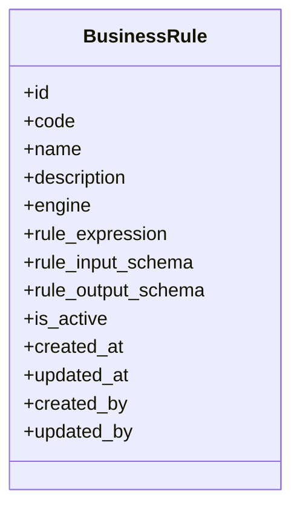

# 0019 — Business Rules (`apps.rules`)

## Status

Proposed

## Context

Dristi has decisions and calculations that change for policy reasons rather than
engineering reasons: court fee slabs, whether a summons may be generated, how a
case is assigned, penalty computation. Encoding these in Python means a release
cycle for every notification or circular.

This spec introduces `apps.rules`, which answers exactly one question:

> **Which rule should be evaluated, with which engine, against which declared
> input, and what output shape does the caller get back?**

It **MUST NOT** invent an expression language of its own. It stores rule
definitions with their input/output contracts, selects the engine at runtime,
validates both ends of the evaluation, and returns a normalized result.

It **MUST**, in this iteration, ship a complete and usable evaluation path for
both engines: the `RuleEngine` abstraction plus two working adapters that import
their library and execute the stored expression against the caller's input
in-process, inside this app. Nothing about evaluation is stubbed, deferred to a
later spec, or delegated to an external service.

Two engines are supported, both fully implemented here:

```text
RULE_ENGINE — expression rules        case_value > 100000 ? 500 : 100
              library: rule-engine    (pure Python, in-process, typed)
GORULES     — decision tables / JDM   <GoRules JDM JSON document>
              library: zen-engine     (official ZEN binding, in-process)
```

Examples:

| `code` | `engine` | `rule_expression` |
| --- | --- | --- |
| `COURT_FEE_CALCULATION` | `rule_engine` | `case_value > 100000 ? 500 : 100` |
| `SUMMONS_GENERATION_ELIGIBILITY` | `gorules` | `{ "nodes": [...], "edges": [...] }` |

Every rule declares a JSON Schema for its input and a JSON Schema for its output.
Input is validated **before** evaluation, so a rule never runs on a payload it was
not written for; output is validated **after** evaluation, so a caller can rely on
the documented structure instead of reverse-engineering what an expression happens
to return.

The boundary against [`0018`](0018-configuration-store.md) is deliberate and MUST
be maintained:

| | Configuration | Business Rules |
| --- | --- | --- |
| Stores | values that tune behavior | logic that produces a decision |
| Example | `payment.payment_expiry_minutes = 30` | `COURT_FEE_CALCULATION` |
| Shape | opaque string | engine + expression + input/output schema |
| Evaluated | no | yes |

Without that line, the configuration store slowly becomes an untyped rule store.

**This iteration does not expose any REST API.** The module is consumed in-process
through service-level functions only, plus Django admin for authoring. A thin DRF
layer MAY be added later on top of the same functions.

## Goals

* Persist rule definitions keyed by a stable `code`, with an explicit engine.
* Declare the input contract (`rule_input_schema`) and the output contract
  (`rule_output_schema`) of every rule as JSON Schema.
* Validate the input payload against `rule_input_schema` before evaluation.
* Validate the engine output against `rule_output_schema` after evaluation.
* Select the engine implementation at runtime from the `engine` column.
* Provide one engine-agnostic entry point: `BusinessRuleService.evaluate()`.
* Define the `RuleEngine` abstraction **and implement both adapters completely**,
  so a rule of either engine can be authored and evaluated as soon as this module
  lands.
* Execute rules in-process inside this app by importing `rule-engine` and
  `zen-engine` — no external rule service, sidecar, or HTTP hop.
* Reuse `rule_input_schema` as the engine's **type** contract, not only as a
  payload validator, so a type error in an expression is caught when the rule is
  saved rather than when it is first evaluated.
* Allow authoring and editing rules in Django admin, where saving MUST validate
  the expression against the declared input and expected output.
* Return a normalized result envelope rather than raw engine output.
* Fail loudly — a broken rule MUST NOT silently return a default.

## Non-goals

* Writing an expression language, parser, or evaluator from scratch. The adapters are complete, working implementations; the parsing and
  evaluation work itself is delegated to `rule-engine` and `zen-engine` rather
  than hand-rolled.
* Engines beyond `rule-engine` and GoRules in this iteration.
* Evaluating rules outside this process — no rule-engine microservice and no
  GoRules BRMS HTTP API.
* A rule authoring UI beyond Django admin (no decision-table editor).
* Letting rules perform I/O — database queries, HTTP calls, file access.
* An explicit `version` column in this iteration (see #3).
* REST/HTTP APIs, serializers, viewsets, or URL routing in this iteration.

---

## Proposed changes

### 1. App layout

Location: `apps.rules` (registered as `"apps.rules"` in `INSTALLED_APPS`).

```text
apps/rules/
├── __init__.py
├── apps.py                 # name = "apps.rules"
├── models.py               # BusinessRule
├── services.py             # BusinessRuleService
├── schemas.py              # JSON Schema validation helpers
├── exceptions.py
├── admin.py
├── forms.py                # admin form with dry-run validation
├── engines/
│   ├── __init__.py         # registry: engine -> implementation
│   ├── base.py             # RuleEngine abstract base class
│   ├── expression.py       # rule-engine adapter (not named rule_engine.py)
│   └── gorules.py          # zen-engine adapter
├── migrations/
└── tests/
    ├── __init__.py
    ├── test_models.py
    ├── test_services.py
    └── test_engines.py
```

No `serializers.py`, `views.py`, or `urls.py` in this iteration.

### 2. Data model

Location: `apps.rules.models`



`BusinessRule` MUST inherit `apps.core.models.BaseModel`,
`apps.core.models.BaseActivatableModel`, and `apps.core.models.BaseAuditableModel`,
per [`0000`](0000-api-coding-spec.md) #3.1. History is not optional here: rules are
editable in admin (#9), so the `simple_history` table from
[`0004`](0004-simple-audit-history.md) is the only record of what an expression
looked like when an earlier decision was taken.

One row is one rule. `code` is the identity used by every consumer.

#### 2.1 Fields

| Field | Type | Description |
| --- | --- | --- |
| `id` | `UUIDField` | Primary key, from `BaseModel` |
| `code` | `CharField(50)`, unique | Stable business identifier used by consumers |
| `name` | `CharField(255)` | Human-readable name |
| `description` | `TextField(blank=True)` | What the rule decides and why |
| `engine` | `CharField(50)` + `TextChoices` | Engine that evaluates `rule_expression` |
| `rule_expression` | `TextField` | Engine-specific rule source |
| `rule_input_schema` | `JSONField` | JSON Schema describing the evaluation input |
| `rule_output_schema` | `JSONField` | JSON Schema describing the evaluation output |
| `is_active` | `BooleanField` | From `BaseActivatableModel`, default `True` |
| `created_at` / `updated_at` | datetime | From `BaseModel` |
| `created_by` / `updated_by` | FK user, nullable | From `BaseModel` |


#### 2.2 `code`

* `code` MUST be unique and MUST match `^[A-Z0-9_]+$` (uppercase snake_case),
  validated in `clean()` — the same convention as `Location.code`.
* `code` is the only identifier a consumer stores or passes:

```python
BusinessRuleService.evaluate(code="COURT_FEE_CALCULATION", payload={...})
```

* `code` SHOULD NOT be renamed once consumers reference it; create a new rule and
  deactivate the old one instead.

#### 2.3 `engine`

`engine` MUST be a `TextChoices` enum, not a free string, with lowercase stored
values and display labels, matching `Location.LocationType`:

```python
class RuleEngineType(models.TextChoices):
    RULE_ENGINE = "rule_engine", "Rule Engine"
    GORULES = "gorules", "GoRules"
```

Only these two values exist in this iteration. The engine implementation is looked
up from this column at runtime (#4.2); no consumer and no caller branches on it.

#### 2.4 `rule_expression`

`rule_expression` is `TextField` because the two engines take different shapes:

* `rule_engine` — a single `rule-engine` expression, not JSON. Payload keys are
  resolved as top-level symbols, and the ternary operator is supported:

  ```text
  case_value > 100000 ? 500 : 100
  ```

* `gorules` — a GoRules JDM document, stored as serialized JSON text and parsed by
  its adapter:

  ```json
  { "nodes": [ ... ], "edges": [ ... ] }
  ```

A `JSONField` would be wrong for `rule_engine` and a per-engine column pair would push
engine knowledge into the schema, so one text column plus engine-owned parsing is
the chosen trade-off (#11.1 revisits it).

Rules:

* `rule_expression` MUST be non-empty and MUST compile under its engine
  (`RuleEngine.validate()`), checked in `clean()`.
* Its size MUST be bounded by `RULES_MAX_EXPRESSION_BYTES` (#8).
* The expression MUST reference only input identifiers declared in
  `rule_input_schema` (#2.6).

#### 2.5 Schemas

Both schema columns hold a **JSON Schema** document.

```json
// rule_input_schema
{
  "type": "object",
  "properties": {
    "case_value": { "type": "number" },
    "case_type":  { "type": "string", "enum": ["civil", "criminal"] }
  },
  "required": ["case_value", "case_type"],
  "additionalProperties": false
}
```

```json
// rule_output_schema
{
  "type": "object",
  "properties": {
    "fee":      { "type": "number" },
    "currency": { "type": "string" }
  },
  "required": ["fee"],
  "additionalProperties": false
}
```

Rules:

* Both columns are required (`default=dict` is not acceptable as a final value); a
  rule without declared contracts MUST be rejected in `clean()`.
* Each MUST itself be a valid JSON Schema, checked with the validator's
  `check_schema()` — an invalid schema is a save-time error, never a runtime
  surprise.
* The top-level `type` of both SHOULD be `"object"`. An object output keeps room
  for a second field later without breaking callers; a scalar output MAY be
  declared where the decision genuinely is one value (for example
  `{"type": "boolean"}` for an eligibility rule).
* `rule_input_schema` SHOULD set `additionalProperties: false` so that a caller
  passing an undeclared key fails fast instead of silently having it ignored.
* Schemas are the published contract of the rule. `rule_output_schema` exists so
  that **the caller knows the output structure** without reading the expression.

##### Schema as the type contract

`rule_input_schema` is not only a payload validator: for the `rule_engine` engine
it is compiled into the library's symbol **type resolver** (#4.4), so the
expression is type-checked at parse time. Comparing a string symbol to a number,
or reading a symbol that is not declared, becomes a save-time error.

JSON Schema types map onto `rule_engine.types.DataType` as follows:

| JSON Schema | `DataType` |
| --- | --- |
| `string` | `STRING` |
| `string` + `format: date-time` / `date` | `DATETIME` |
| `number`, `integer` | `FLOAT` (backed by `decimal.Decimal`) |
| `boolean` | `BOOLEAN` |
| `object` | `MAPPING` |
| `array` | `ARRAY` |
| `null` | `NULL` |
| absent / union (`anyOf`, `type` list) | `UNDEFINED` |

Rules:

* The mapping lives in `apps.rules.schemas` and is shared by the adapter and the
  admin form, so authoring and runtime cannot disagree.
* A property the mapping cannot type MUST become `UNDEFINED` rather than a guess.
  `UNDEFINED` disables type checking for that symbol only; it MUST NOT silently
  disable it for the whole rule.
* `FLOAT` is `Decimal`-backed, which is why #4.4 requires output normalization
  before the result is validated against `rule_output_schema`.
* No new model column is needed for types. Deriving them from the schema the
  caller already has to satisfy keeps one source of truth; a separate
  `symbol_types` column would be a second one to drift.

#### 2.6 Expression / schema agreement

Saving a rule MUST verify that the expression and the schemas describe the same
rule, not just that each is individually well-formed:

1. **Static check** — the identifiers the expression reads MUST be declared in
   `rule_input_schema`. The engine adapter exposes
   `referenced_inputs(rule_expression)`; for `rule_engine` these are the symbols
   the parser recorded, for `gorules` the input fields used by the graph's nodes.
   An undeclared identifier raises `RuleDefinitionError`.
2. **Type check** — for `rule_engine`, parsing with the derived type resolver
   (#2.5) MUST succeed. A type-incompatible comparison raises
   `RuleDefinitionError` at save time, not at the first evaluation.
3. **Dry run** — the rule MUST be evaluated against at least one sample input and
   the output MUST validate against `rule_output_schema` (#9.1).

A rule that passes all three is guaranteed to be callable; one that passes none
would otherwise fail in production at the first evaluation.

#### 2.7 Constraints and meta

* `code` unique (field-level `unique=True`, as in `Location`).
* `Meta.ordering = ("code",)` — MUST be explicit; this table is read as a
  catalogue.
* `engine` MUST be `db_index=True` (admin filtering, engine-scoped maintenance).
* `is_active` carries the kill switch: `evaluate()` resolves active rules only.
* `__str__` SHOULD return `f"{self.name} ({self.code})"`, matching `Location`.

### 3. Lifecycle and change history

This iteration has **no `version` column**. A rule is edited in place, and
`BaseAuditableModel` keeps every prior state, with the responsible user, in the
history table.

Consequences, stated plainly:

* Editing a rule changes future evaluations immediately; there is no draft state.
* Callers that must explain an old decision MUST persist the decision they got
  (the result envelope, #5.2) alongside their business record. They cannot
  reconstruct it from the rule row, only from the history table.
* Retiring a rule means `is_active = False`, never `delete()`.

Explicit versioning with pinned evaluation is deliberately deferred; it is an open
question (#11.6) and the natural next iteration if a consumer needs reproducible
replay rather than an audit trail.

### 4. Engine abstraction

```text
BusinessRuleService
        |
        v
   RuleEngine (ABC)
        |
   +----+-----------+
   |                |
 RULE_ENGINE     GORULES
```

#### 4.1 Abstract base class

Location: `apps.rules.engines.base`

`RuleEngine` is an `abc.ABC`. Every abstract method below MUST be implemented by
both adapters in this iteration; there is no placeholder engine.

```python
class RuleEngine(abc.ABC):
    """Engine-agnostic contract for compiling and evaluating a rule expression."""

    engine: str  # RuleEngineType value

    @abc.abstractmethod
    def validate(self, rule_expression: str, rule_input_schema: dict) -> None:
        """Raise RuleDefinitionError if the expression cannot be compiled, or is
        not type-compatible with the declared input schema."""

    @abc.abstractmethod
    def referenced_inputs(self, rule_expression: str, rule_input_schema: dict) -> set[str]:
        """Return the input identifiers the expression reads (#2.6)."""

    @abc.abstractmethod
    def evaluate(self, rule_expression: str, payload: dict, rule_input_schema: dict) -> Any:
        """Return the raw engine output for the expression applied to payload."""

    def evaluate_with_timeout(self, rule_expression: str, payload: dict, rule_input_schema: dict) -> Any:
        """Concrete wrapper: deep-copy the payload, apply the #8 timeout, and
        translate any engine error into RuleEvaluationError."""
```

`rule_input_schema` is part of every signature because the `rule_engine` adapter
needs it to build its type resolver (#2.5, #4.4). The GoRules adapter accepts and
ignores it; a uniform signature keeps the branch out of the service.

`evaluate_with_timeout()` is concrete on the base class so the timeout, the
exception translation, and the "never mutate the caller's payload" copy are
written once instead of once per adapter. `BusinessRuleService` calls this
method, never `evaluate()` directly.

Rules for implementations:

* An adapter MUST be a pure function of (`rule_expression`, `payload`). It MUST
  NOT query the database, call HTTP services, read files, or mutate `payload`.
* An adapter MUST translate every library-specific exception into a module
  exception (`RuleDefinitionError`, `RuleEvaluationError`). Library exceptions
  MUST NOT leak to consumers — that is the whole point of the abstraction.
* An adapter MUST NOT be imported directly by any consumer.
* An adapter MUST NOT know about the schema columns; schema validation is the
  service's job (#5.1), so both engines behave identically at the boundary.

#### 4.2 Runtime selection and registry

`apps.rules.engines.__init__` exposes `get_engine(engine) -> RuleEngine`, backed by
an explicit mapping from `RuleEngineType` values to adapter instances.

```text
rule.engine == "rule_engine"  -> RuleEngineAdapter
rule.engine == "gorules"  -> GoRulesRuleEngine
```

The engine is therefore chosen at evaluation time from stored data; adding an
engine later touches the registry plus the `TextChoices` enum and requires a
migration only for the new choice label.

An engine value with no registered adapter raises `EngineNotAvailable`.

#### 4.3 Safety

* Evaluation MUST run under a timeout (`RULES_EVALUATION_TIMEOUT_SECONDS`, #8).
* Adapters MUST NOT expose Python builtins, imports, or attribute access to host
  objects to the expression.
* `payload` MUST be plain JSON-serializable data. Passing model instances is
  forbidden: it would let a rule traverse relations and perform I/O. JSON Schema
  validation (#5.1) rejects them anyway, which is a pleasant side effect of
  declaring the input contract.

#### 4.4 Rule Engine adapter

Location: `apps.rules.engines.expression`

The module is deliberately **not** named `rule_engine.py`: it would shadow nothing
under absolute imports, but a file importing a library with its own name is a
reliable source of confusion for the next reader.

Backed by [`rule-engine`](https://pypi.org/project/rule-engine/) (the
`zerosteiner/rule-engine` project), which parses and evaluates its own typed
expression language in pure Python, in-process. It is preferred over a JEXL port
because it is actively maintained, statically type-checks an expression against
declared symbol types, and reports the symbols a rule references — the two
capabilities #2.5 and #2.6 depend on.

```python
import rule_engine

class RuleEngineAdapter(RuleEngine):
    engine = BusinessRule.RuleEngineType.RULE_ENGINE

    def _context(self, rule_input_schema):
        return rule_engine.Context(
            resolver=rule_engine.resolve_item,          # payload is a dict
            type_resolver=rule_engine.type_resolver_from_dict(
                datatypes_from_json_schema(rule_input_schema),   # #2.5 mapping
            ),
        )

    def validate(self, rule_expression, rule_input_schema):
        self._compile(rule_expression, rule_input_schema)   # parse + type check

    def referenced_inputs(self, rule_expression, rule_input_schema):
        context = self._context(rule_input_schema)
        rule_engine.Rule(rule_expression, context=context)
        return set(context.symbols)                     # recorded at parse time

    def evaluate(self, rule_expression, payload, rule_input_schema):
        rule = self._compile(rule_expression, rule_input_schema)
        return normalize(rule.evaluate(payload))        # Decimal/datetime -> JSON
```

Rules:

* Payload keys are resolved as **top-level symbols** via
  `rule_engine.resolve_item`, so an expression reads `case_value`, not
  `input.case_value`. This is the library's idiom and it is what makes
  `Context.symbols` and the type resolver line up with `rule_input_schema`
  properties one-for-one.
* `referenced_inputs()` MUST read the symbol set the parser recorded on the
  `Context`, never a regex over the source. The #2.6 check is only trustworthy if
  it sees what the parser saw.
* Builtins (`$now` and friends) are **not** input symbols and MUST be excluded
  from the #2.6 comparison. A rule that reads `$now` is time-dependent, which is
  worth a review comment but is not a schema violation.
* `rule.evaluate()` MUST be used rather than `rule.matches()`. `matches()` coerces
  the result to a boolean, which would quietly turn a fee calculation into `True`.
  Whether the result is a boolean, a number, or an object is decided by
  `rule_output_schema`, not by the call style.
* **Output normalization is mandatory.** The library's `FLOAT` type is
  `decimal.Decimal` and its `DATETIME` is `datetime.datetime`; neither is JSON
  native. The adapter MUST convert `Decimal` to a JSON number and datetimes to
  ISO-8601 strings before the service validates against `rule_output_schema`.
  Skipping this would make every numeric rule fail output validation.
* The `Context` MUST be built per `(rule_expression, rule_input_schema)` pair and
  MAY be memoized per #7; it MUST NOT be shared across rules, because the type
  resolver is rule-specific.
* No custom attributes or builtins are registered in this iteration. Each one
  creates a vocabulary that every stored expression then silently depends on; see
  #11.12.
* Every `rule_engine` exception (`EngineError`, `SymbolResolutionError`,
  `EvaluationError`, type errors) MUST be translated into `RuleDefinitionError` at
  parse time or `RuleEvaluationError` at evaluation time, and MUST NOT escape the
  adapter.
* Because the library is pure Python, the #8 timeout can be enforced with an
  ordinary thread/signal guard — unlike the GoRules adapter (#11.11).

`validate()`, `referenced_inputs()`, and `evaluate()` take the input schema as an
argument here, so the `RuleEngine` signatures in #4.1 pass `rule_input_schema` to
every adapter; the GoRules adapter ignores it.

#### 4.5 GoRules adapter

Location: `apps.rules.engines.gorules`

Backed by [`zen-engine`](https://pypi.org/project/zen-engine/), the official
GoRules ZEN Python binding, which evaluates a JDM graph in-process.

```python
import json

import zen

class GoRulesRuleEngine(RuleEngine):
    engine = BusinessRule.RuleEngineType.GORULES

    def __init__(self):
        self._engine = zen.ZenEngine()        # no loader callback: see below

    def validate(self, rule_expression, rule_input_schema=None):
        self._decision(rule_expression)       # json.loads + create_decision

    def referenced_inputs(self, rule_expression, rule_input_schema=None):
        graph = json.loads(rule_expression)
        return self._input_fields(graph)      # fields read by input/table nodes

    def evaluate(self, rule_expression, payload, rule_input_schema=None):
        return self._decision(rule_expression).evaluate(payload)["result"]
```

Rules:

* `rule_expression` holds the JDM document as JSON text (#2.4); the adapter owns
  `json.loads` and MUST raise `RuleDefinitionError` for malformed JSON or for a
  graph ZEN refuses to compile.
* The engine MUST be created **without** a loader callback. ZEN's loader exists to
  fetch referenced graphs from disk or a service; enabling it would hand a stored
  rule the ability to perform I/O, which #4.1 forbids. Cross-graph references are
  therefore rejected at save time.
* `decision.evaluate()` returns the result together with performance/trace
  metadata. The adapter MUST return only `result`; the rest is engine-native
  output and stays behind the abstraction (#5.2).
* Tracing MUST be off by default. It MAY be enabled for the admin dry run (#9.1),
  which is interactive and off any request hot path, to help an author debug a
  decision table.
* `referenced_inputs()` reads the input fields declared by the graph's nodes. If a
  graph shape makes that undecidable, the adapter MUST raise `RuleDefinitionError`
  rather than return an incomplete set — a half-known input surface would make the
  #2.6 check lie.

#### 4.6 Dependencies and startup

```toml
# pyproject.toml
dependencies = [
    "rule-engine>=5.0",     # typed expression parsing and evaluation
    "zen-engine>=2.1.0",    # GoRules JDM evaluation
    "jsonschema>=4.0",      # input/output schema validation
]
```

Adapters are instantiated once per process and registered in the #4.2 registry at
app load, so a missing or broken dependency fails at startup rather than at the
first evaluation.

`zen-engine` ships a compiled Rust extension, so the Docker base image MUST be
verified to provide a wheel for its platform; otherwise the image build needs a
Rust toolchain (#11.10).

### 5. Service interface

Location: `apps.rules.services`

```text
evaluate(code, payload)                -> dict   # result envelope
get_rule(code)                         -> BusinessRule
validate_rule(rule)                    -> None   # expression + schemas (#2.6)
dry_run(rule, payload)                 -> dict   # evaluate without requiring active
```

Consumers MUST use this service and MUST NOT import `apps.rules.engines` or query
`BusinessRule.objects` directly.

#### 5.1 `evaluate()`

```python
BusinessRuleService.evaluate(
    code="COURT_FEE_CALCULATION",
    payload={
        "case_value": 150000,
        "case_type": "civil",
    },
)
```

Resolution:

```text
evaluate(code, payload)
      |
      v
fetch active BusinessRule by code          -> RuleNotFound
      |
      v
validate payload vs rule_input_schema      -> RuleInputError
      |
      v
get_engine(rule.engine)                    -> EngineNotAvailable
      |
      v
engine.evaluate_with_timeout(
    rule.rule_expression, payload, rule.rule_input_schema
)                                          -> RuleEvaluationError
      |
      v
validate output vs rule_output_schema      -> RuleOutputError
      |
      v
normalized result envelope
```

Rules:

* Only `is_active=True` rules are resolvable. An inactive rule is
  indistinguishable from a missing one and raises `RuleNotFound`.
* Input validation MUST happen before the engine is touched. An invalid payload is
  a caller bug and must be reported as such, not as a rule failure.
* Output validation MUST happen before returning. If an expression is edited into
  returning the wrong shape, the module fails rather than passing an unexpected
  structure to a caller that trusted the schema.
* Validation errors MUST name the offending JSON path so the message is actionable.

#### 5.2 Result envelope

The native output of an engine MUST NOT be returned directly. `evaluate()` returns:

```json
{
  "code": "COURT_FEE_CALCULATION",
  "engine": "rule_engine",
  "result": { "fee": 500, "currency": "INR" }
}
```

For a boolean rule:

```json
{
  "code": "SUMMONS_GENERATION_ELIGIBILITY",
  "engine": "gorules",
  "result": true
}
```

* `result` is exactly the value that validated against `rule_output_schema`.
* `engine` is included for observability. Consumers SHOULD branch on `result`
  only; branching on `engine` defeats the abstraction.
* Engine-native output (GoRules trace/explain data) MAY be exposed later behind an
  explicit opt-in flag if a consumer proves it needs it — not by default.

#### 5.3 Style

* Plain Python callables, plain data in and out.
* No dependency on request/response objects, DRF, or HTTP status codes.
* Errors are Python exceptions; a future REST layer maps them.

### 6. Error handling

| Exception | Raised when |
| --- | --- |
| `RuleNotFound` | No active rule for `code` |
| `EngineNotAvailable` | `rule.engine` has no registered adapter |
| `RuleSchemaError` | `rule_input_schema` / `rule_output_schema` is not a valid JSON Schema |
| `RuleDefinitionError` | Expression fails to compile, or reads an undeclared input (#2.6) |
| `RuleInputError` | `payload` fails `rule_input_schema` |
| `RuleOutputError` | Engine output fails `rule_output_schema` |
| `RuleEvaluationError` | Evaluation raises or exceeds the timeout |

All MUST derive from a common `RuleError`.

Save-time failures (`RuleSchemaError`, `RuleDefinitionError`) MUST surface as
`django.core.exceptions.ValidationError` in `clean()` so admin renders them against
the right field.

`evaluate()` MUST NOT swallow failures and return a default. A silently defaulted
court fee is worse than a failed request; the caller decides the fallback.

### 7. Caching

Rule rows are read-heavy and change rarely.

* `rules_businessrule` SHOULD be added to the cachalot allow-list per
  [`0012`](0012-redis-caching.md), so the lookup by `code` is served from Redis and
  invalidated on write.
* Compiled artefacts (a `rule_engine.Rule` with its `Context`, a loaded GoRules
  graph) and compiled JSON
  Schema validators MAY be memoized keyed on `(rule.id, rule.updated_at)` — the
  `updated_at` component is mandatory, because rules are editable (#3) and a cache
  keyed on `id` alone would serve a stale expression after an admin edit.
* Evaluation results MUST NOT be cached in this iteration — the input space is
  unbounded and correctness beats the saving.

### 8. Configuration

New settings read in `config.settings.base`, from environment variables,
documented in `.env.example` and `README.md`:

```text
RULES_EVALUATION_TIMEOUT_SECONDS      # per-evaluation guard, default 2
RULES_MAX_EXPRESSION_BYTES            # guard on rule_expression size
RULES_ADMIN_DRY_RUN_REQUIRED          # enforce #9.1 sample evaluation on save
```

Both engines are always registered; there is no enable/disable env flag, because
the engine set is fixed in this iteration and a disabled engine would only turn a
save-time error into a runtime one.

### 9. Admin

Admin is the authoring surface in this iteration.

Location: `apps.rules.admin`, `apps.rules.forms`

* `BusinessRule` MUST be registered with `list_display` of `code`, `name`,
  `engine`, `is_active`, `updated_at`; `list_filter` on `engine` and `is_active`;
  `search_fields` on `code`, `name`, `description`.
* `code`, `name`, `description`, `engine`, `rule_expression`,
  `rule_input_schema`, `rule_output_schema`, and `is_active` are all editable —
  rules are expected to be maintained by operators, not by deployments.
* `created_by` / `updated_by` MUST be read-only and stamped from the request user.
* The admin MUST use `SimpleHistoryAdmin` from [`0004`](0004-simple-audit-history.md)
  so every edit is inspectable.

#### 9.1 Save-time validation

The admin form MUST NOT save a rule that cannot be evaluated. On save it MUST, in
order:

1. Validate `rule_input_schema` and `rule_output_schema` with `check_schema()`.
2. Resolve the engine for `engine` and call `validate(rule_expression)`.
3. Run the static identifier check of #2.6 against `rule_input_schema`.
4. **Dry run**: evaluate `rule_expression` against a sample input and validate the
   output against `rule_output_schema`.

For step 4 the form exposes a non-model textarea, `test_input`, holding a sample
payload:

```text
Rule expression    : input.case_value > 100000 ? {"fee": 500} : {"fee": 100}
Test input (JSON)  : {"case_value": 150000, "case_type": "civil"}
Expected result    : {"fee": 500}        # optional
```

Rules:

* `test_input` MUST itself validate against `rule_input_schema`; this catches the
  common case of a schema and a sample drifting apart.
* The dry run goes through `BusinessRuleService.dry_run()`, so admin and runtime
  share one evaluation path.
* The dry-run result MUST be shown back to the author as an admin message, so the
  author sees what the rule returns rather than only that it passed.
* An optional `expected_result` field MAY be provided; when present, the dry-run
  output MUST equal it or the save is rejected.
* `test_input` and `expected_result` are **not persisted** in this iteration.
  Promoting them to columns (a stored regression sample per rule) is #11.5.
* `RULES_ADMIN_DRY_RUN_REQUIRED` (#8) controls whether step 4 is mandatory; it
  MUST default to on. Steps 1–3 are always mandatory.

### 10. Testing

Required coverage:

* `code` uniqueness and uppercase-format validation.
* `clean()` rejecting: empty `rule_expression`, an oversized expression, an invalid
  JSON Schema in either schema column, missing schemas, an expression that reads an
  undeclared input (#2.6), and an expression that does not compile.
* `evaluate()` happy path for a `rule_engine` rule and for a `gorules` rule,
  asserting the exact result envelope.
* `evaluate()` on an inactive rule and an unknown code → `RuleNotFound`.
* `RuleInputError` for a payload missing a required property, with a wrong type,
  and with an undeclared extra property under `additionalProperties: false`.
* `RuleOutputError` when the expression returns a shape the output schema rejects
  — including that the error is raised instead of the value being returned.
* Input validation runs **before** the engine (assert the engine was not called).
* `EngineNotAvailable` for an engine value with no adapter.
* Timeout guard terminates a runaway expression.
* Model instance in `payload` is rejected.
* Admin form: save blocked when the dry run fails, when `test_input` does not match
  `rule_input_schema`, and when `expected_result` differs; save allowed and history
  row written when all four steps pass.
* Per-engine end-to-end tests against the **real** libraries: a `rule_engine`
  expression rule and a `gorules` decision table, each saved and then evaluated
  through `BusinessRuleService.evaluate()`. These MUST NOT be mocked — the point
  of this iteration is that both paths actually execute in-process.
* Adapter-level tests for `validate()`, `referenced_inputs()` (`Context.symbols`
  for `rule_engine`, node-based for GoRules), and exception translation for each
  library's error type.
* The JSON Schema → `DataType` mapping of #2.5, including the `UNDEFINED` fallback
  for an untypable property.
* Type checking at save time: comparing a `string` symbol against a number is
  rejected as `RuleDefinitionError` before any evaluation happens.
* Output normalization: a `Decimal` result validates against a `number` output
  schema and a datetime result against a `date-time` string — asserted on the
  value actually returned, since this is where a naive implementation breaks.
* `evaluate()` is used rather than `matches()`: a numeric rule returns its number,
  not `True`.
* A `$now` builtin does not trip the #2.6 undeclared-symbol check.
* GoRules trace/performance metadata is stripped from `result`.
* `evaluate_with_timeout()` does not mutate the caller's `payload`.
* A fake in-memory engine registered in tests, used only for service-level
  behavior (resolution, schema validation, error mapping), so those tests stay
  fast and library-independent.
* Cache key includes `updated_at`: editing an expression changes the next
  evaluation (#7).

Quality checks before committing:

```bash
cd src && DJANGO_SETTINGS_MODULE=config.settings.test pytest
cd src && ruff check . && ruff format .
cd src && python manage.py check
```

---

## 11. Open questions

1. Should `rule_expression` stay a single `TextField` for both engines, or should
   GoRules documents move to a `JSONField` with a second column (and a check
   constraint tying the populated column to `engine`)?
2. `rule-engine` is designed primarily around boolean matching rules. Are
   value-returning rules (fee amounts, objects) idiomatic enough in practice, or
   should value-producing logic be pushed to GoRules decision tables and
   `rule_engine` reserved for eligibility/validation booleans?
3. Should an evaluation audit trail (`RuleEvaluation`: rule, payload hash, result,
   timestamp) live in this module or in each consumer? Court fee computation
   probably wants it; eligibility checks would flood it.
4. Does the project's Docker base image get a prebuilt `zen-engine` wheel, or
    does the image need a Rust toolchain (#4.6)?
5. How is the #8 timeout enforced for `zen-engine`, whose evaluation runs inside
    a Rust extension that a Python signal or thread guard cannot interrupt
    mid-call? A subprocess/worker boundary may be the only reliable answer. The
    `rule_engine` adapter is pure Python and does not have this problem.
6. Should the `rule_engine` adapter register custom attributes or builtins (date
    handling, rounding, currency) in a later iteration, and who then owns that
    vocabulary (#4.4)?
7. How should numeric output be normalized (#4.4) — `Decimal` to `float` (lossy
    but JSON-native) or to a decimal string (exact, but typed as `string` in the
    output schema)? Court fees are money, so this is not a cosmetic choice.

---

## 12. Out of scope

* Inventing an expression language or hand-writing an evaluator — both adapters
  are fully implemented here on top of `rule-engine` and `zen-engine`.
* Engines other than `rule-engine` and GoRules.
* Custom `rule_engine` attributes, builtins, or type coercions beyond the library
  defaults.
* GoRules cross-graph references and ZEN loader callbacks.
* Out-of-process rule evaluation.
* REST APIs, serializers, viewsets, routing, and Swagger annotations.
* A decision-table authoring UI.
* Workflow orchestration and rule chaining.
* I/O from inside rule expressions.
* Explicit rule versioning and pinned replay.
* Per-organization rule variants.
* Caching of evaluation results.
* Scheduled or event-triggered rule execution.
* Rule-level access control.
